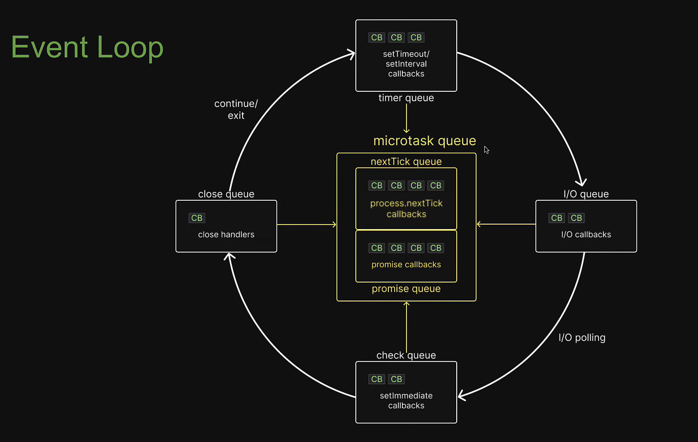
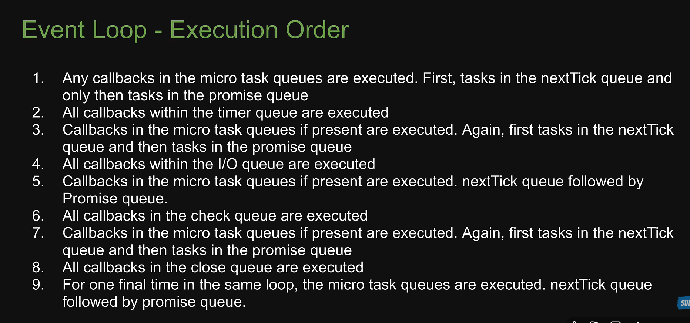
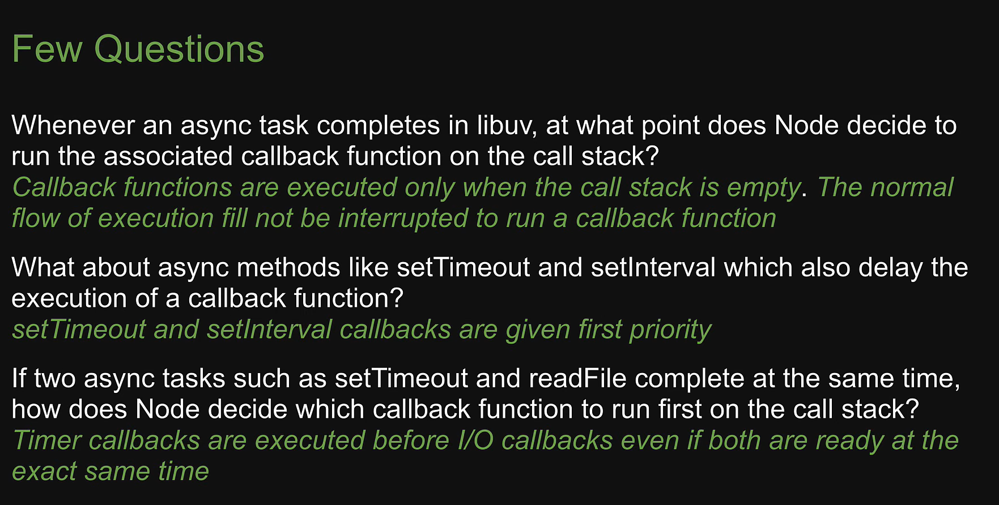

# libuv in Node.js — A Detailed Guide

---

## Table of Contents

1. [What is libuv?](#1-what-is-libuv)
2. [Why does Node.js need libuv?](#2-why-does-nodejs-need-libuv)
3. [Architecture Overview](#3-architecture-overview)
4. [The Event Loop](#4-the-event-loop)
5. [Event Loop Phases (in order)](#5-event-loop-phases-in-order)
6. [Thread Pool](#6-thread-pool)
7. [Handles and Requests](#7-handles-and-requests)
8. [I/O Polling](#8-io-polling)
9. [Timers in libuv](#9-timers-in-libuv)
10. [libuv vs the Browser Event Loop](#10-libuv-vs-the-browser-event-loop)
11. [Common Misconceptions](#11-common-misconceptions)
12. [Quick Reference Cheatsheet](#12-quick-reference-cheatsheet)

---

## 1. What is libuv?

**libuv** is a **multi-platform C library** that provides Node.js with:

- An **event loop**
- **Asynchronous I/O** (file system, networking, DNS, etc.)
- A **thread pool** for offloading blocking operations
- Cross-platform abstractions (works on Windows, Linux, macOS)

> Think of libuv as the **engine under Node.js's hood** — JavaScript gives you the steering wheel, but libuv is what actually drives.

It was originally written specifically for Node.js but is now an independent open-source project used by other runtimes too (e.g. Julia, Luvit).

- **Language:** C
- **Repository:** https://github.com/libuv/libuv
- **Version bundled with Node.js:** check with `process.versions.uv`

```javascript
console.log(process.versions.uv); // e.g. → 1.46.0
```

---

## 2. Why does Node.js need libuv?

JavaScript is **single-threaded** — it can only do one thing at a time. But real-world applications need to:

- Read files from disk
- Make network requests
- Query databases
- Run DNS lookups

These operations are **slow and blocking** by nature. If JavaScript waited for each one to finish, the entire program would freeze.

### The Problem Without libuv

```
Read file → FREEZE for 200ms → Continue → FREEZE for DB query → Continue
```

### The Solution With libuv

```
Read file → hand off to libuv → continue running JS → libuv finishes → callback fires
```

libuv handles the waiting **in the background**, allowing Node.js to remain non-blocking and handle thousands of concurrent operations efficiently.

---

## 3. Architecture Overview

```
┌───────────────────────────────────────────┐
│             Your JavaScript Code           │
├───────────────────────────────────────────┤
│                Node.js APIs               │
│   (fs, http, net, dns, child_process...)  │
├───────────────────────────────────────────┤
│              Node.js Bindings             │
│         (C++ bridge — Node core)          │
├───────────────────────────────────────────┤
│                  libuv                    │
│  ┌─────────────────┐  ┌────────────────┐  │
│  │   Event Loop    │  │  Thread Pool   │  │
│  │  (main thread)  │  │  (4 threads)   │  │
│  └─────────────────┘  └────────────────┘  │
├───────────────────────────────────────────┤
│           Operating System                │
│  (epoll / kqueue / IOCP / select)         │
└───────────────────────────────────────────┘
```

- **Your JS code** runs on the V8 engine
- **Node.js bindings** connect JS APIs to C++ and libuv
- **libuv** manages async I/O and delegates to the OS
- **OS-level polling** (`epoll` on Linux, `kqueue` on macOS, `IOCP` on Windows) does the actual waiting

---

## 4. The Event Loop

The **event loop** is the heart of libuv. It is a loop that continuously checks:

1. Are there any pending callbacks to run?
2. Are there any I/O events ready?
3. Are there any timers that have expired?

If yes to any — run them. If no — wait or exit.

```
   ┌─────────────────────────────┐
   │         Start / Entry        │
   └────────────┬────────────────┘
                │
                ▼
   ┌────────────────────────────┐
   │  Are there tasks to do?    │◄──────────────────┐
   └────────────┬───────────────┘                   │
                │ Yes                                │
                ▼                                    │
   ┌────────────────────────────┐                   │
   │   Run the next phase       │                   │
   └────────────┬───────────────┘                   │
                │                                    │
                ▼                                    │
   ┌────────────────────────────┐                   │
   │  More tasks/phases left?   │ ──── Yes ─────────┘
   └────────────┬───────────────┘
                │ No
                ▼
   ┌────────────────────────────┐
   │         Process exits       │
   └────────────────────────────┘
```

---





---

## 5. Event Loop Phases (in order)

The event loop runs through **6 phases** in every iteration (called a "tick"):

```
   ┌─────────────────────────────────────────┐
   │                                         │
   │   ┌──────────┐      ┌───────────────┐   │
   │   │  timers  │ ───► │ pending I/O   │   │
   │   └──────────┘      │  callbacks    │   │
   │        ▲            └───────┬───────┘   │
   │        │                    │           │
   │        │            ┌───────▼───────┐   │
   │        │            │   idle,       │   │
   │        │            │   prepare     │   │
   │        │            └───────┬───────┘   │
   │        │                    │           │
   │        │            ┌───────▼───────┐   │
   │        │            │     poll      │   │
   │        │            └───────┬───────┘   │
   │        │                    │           │
   │        │            ┌───────▼───────┐   │
   │        │            │    check      │   │
   │        │            └───────┬───────┘   │
   │        │                    │           │
   │        │            ┌───────▼───────┐   │
   │        └────────────│   close       │   │
   │                     │  callbacks    │   │
   │                     └───────────────┘   │
   └─────────────────────────────────────────┘
```

### Phase 1 — Timers
- Executes callbacks from **`setTimeout()`** and **`setInterval()`**
- Runs callbacks whose delay threshold has **expired**
- Note: the delay is a *minimum* guarantee, not an exact time

```javascript
setTimeout(() => console.log("timer fired"), 0);
// Runs in the timers phase — but NOT before I/O callbacks from the previous loop
```

### Phase 2 — Pending I/O Callbacks
- Executes **I/O callbacks deferred from the previous loop iteration**
- Example: TCP errors, system-level errors reported late

### Phase 3 — Idle, Prepare
- Used **internally by libuv** only
- Not directly accessible from JavaScript
- libuv uses this to prepare for the poll phase

### Phase 4 — Poll ⭐ (Most Important)
- The phase where Node.js **waits for new I/O events**
- Retrieves new I/O events from the OS (via epoll/kqueue/IOCP)
- Executes I/O-related callbacks (file reads, network responses, etc.)
- If the poll queue is empty:
  - If `setImmediate()` callbacks exist → move to **check** phase
  - Otherwise → wait here until a timer expires or I/O arrives

### Phase 5 — Check
- Executes **`setImmediate()`** callbacks
- Always runs after the poll phase, even if poll queue is empty

```javascript
setImmediate(() => console.log("setImmediate fired"));
// Guaranteed to run in this phase, after I/O
```

### Phase 6 — Close Callbacks
- Handles **close events** — e.g. `socket.on('close', ...)` or `process.on('exit', ...)`
- Cleanup callbacks when handles are abruptly closed

---

### Special Microtask Queue (runs between every phase)

Before moving to the next phase, Node.js drains two special queues:

| Queue | Triggered by |
|---|---|
| `process.nextTick()` queue | `process.nextTick(callback)` |
| Microtask queue | `Promise.then()`, `async/await` |

> `process.nextTick()` runs **before** Promise microtasks.

```javascript
setTimeout(() => console.log("1 - setTimeout"), 0);
Promise.resolve().then(() => console.log("2 - Promise"));
process.nextTick(() => console.log("3 - nextTick"));
console.log("4 - synchronous");

// Output order:
// 4 - synchronous
// 3 - nextTick       ← nextTick queue (before Promises)
// 2 - Promise        ← microtask queue
// 1 - setTimeout     ← timers phase (next loop iteration)
```

---

## 6. Thread Pool

Some operations **cannot be made asynchronous** at the OS level, or are too expensive to run on the main thread. libuv offloads these to a **thread pool**.

### Default size: 4 threads

```javascript
// Increase the thread pool size (set before Node starts)
process.env.UV_THREADPOOL_SIZE = 8; // up to 1024
```

### What uses the Thread Pool?

| Category | Examples |
|---|---|
| **File System** | `fs.readFile()`, `fs.writeFile()`, `fs.stat()` |
| **DNS** | `dns.lookup()` (not `dns.resolve()`) |
| **Crypto** | `crypto.pbkdf2()`, `crypto.scrypt()`, `crypto.randomBytes()` |
| **Zlib** | `zlib.gzip()`, `zlib.deflate()` |
| **User C++ addons** | Custom native modules |

### What does NOT use the Thread Pool?

| Category | Why |
|---|---|
| **TCP/UDP networking** | Uses OS async I/O (epoll/IOCP) directly |
| **HTTP requests** | Built on async TCP sockets |
| **Timers** | Managed by libuv's timer heap |
| **Child processes** | Uses OS process APIs |

### Thread Pool Example

```javascript
import crypto from "crypto";

console.log("Start");

// This runs in the thread pool — doesn't block the main thread
crypto.pbkdf2("password", "salt", 100000, 64, "sha512", (err, key) => {
  console.log("pbkdf2 done:", key.toString("hex").slice(0, 20) + "...");
});

console.log("End — this prints before pbkdf2 finishes!");

// Output:
// Start
// End — this prints before pbkdf2 finishes!
// pbkdf2 done: 3745e48...
```

---

## 7. Handles and Requests

libuv internally works with two building blocks:

### Handles
Long-lived objects that can perform operations while active.

| Handle Type | Used for |
|---|---|
| `uv_tcp_t` | TCP connections |
| `uv_udp_t` | UDP sockets |
| `uv_timer_t` | setTimeout / setInterval |
| `uv_fs_event_t` | File system watchers (`fs.watch`) |
| `uv_process_t` | Child processes |

### Requests
Short-lived, represent a single operation on a handle or standalone.

| Request Type | Used for |
|---|---|
| `uv_fs_t` | Single file system operation |
| `uv_write_t` | Single write to a stream |
| `uv_connect_t` | Single TCP connect |
| `uv_getaddrinfo_t` | DNS lookup |

> The event loop keeps running **as long as there are active handles or pending requests**.

---

## 8. I/O Polling

libuv uses different OS mechanisms depending on the platform to efficiently wait for I/O:

| OS | Mechanism | Description |
|---|---|---|
| **Linux** | `epoll` | Scalable I/O event notification |
| **macOS / BSD** | `kqueue` | Kernel event notification |
| **Windows** | `IOCP` | I/O Completion Ports |
| **Fallback** | `select` | Older, less scalable |

These are **OS-level tools** that allow a single thread to monitor thousands of file descriptors (sockets, files) simultaneously without polling in a loop — the OS notifies Node when something is ready.

---

## 9. Timers in libuv

libuv manages timers using a **min-heap** (a priority queue sorted by expiry time).

```
setTimeout(fn, 100)   → inserted into heap with expiry = now + 100ms
setTimeout(fn, 50)    → inserted into heap with expiry = now + 50ms
setTimeout(fn, 200)   → inserted into heap with expiry = now + 200ms

Heap (ordered by soonest expiry):
  [50ms] → [100ms] → [200ms]
```

At the start of every **timers phase**, libuv checks the top of the heap. If the expiry time has passed, it fires the callback, removes it from the heap, and checks the next one.

### Why `setTimeout(fn, 0)` is not immediate

```javascript
setTimeout(() => console.log("timeout"), 0);
console.log("sync");

// Output:
// sync         ← runs first (synchronous code)
// timeout      ← runs in next loop iteration's timers phase
```

Even with 0ms delay, the callback goes into the **timers phase** of the next loop tick — it never runs before the current synchronous code finishes.

---

## 10. libuv vs the Browser Event Loop

| Feature | libuv (Node.js) | Browser |
|---|---|---|
| **Event loop** | libuv | Built into browser engine |
| **Microtasks** | `process.nextTick` + Promises | Promises, MutationObserver |
| **Macrotasks** | `setTimeout`, `setInterval`, I/O | `setTimeout`, `setInterval`, UI events |
| **setImmediate** | ✅ Available | ❌ Not available |
| **process.nextTick** | ✅ Available | ❌ Not available |
| **Thread pool** | ✅ libuv thread pool | Web Workers (separate API) |
| **I/O operations** | File, Network, DNS, Crypto | Only network (fetch/XHR) |
| **DOM events** | ❌ No DOM | ✅ click, scroll, etc. |

---

## 11. Common Misconceptions

### ❌ "Node.js is multi-threaded"
**✅ Reality:** JavaScript runs on a **single thread**. libuv uses threads internally (thread pool), but your JS code never runs in parallel — it's concurrent via the event loop, not parallel.

### ❌ "setTimeout(fn, 0) runs immediately"
**✅ Reality:** It runs at the earliest in the **next event loop iteration**, after all synchronous code and microtasks finish.

### ❌ "All async operations use the thread pool"
**✅ Reality:** Only file system, crypto, DNS lookup, and zlib use the thread pool. **Network I/O** is fully async via OS mechanisms (epoll/kqueue) and does **not** use threads.

### ❌ "setImmediate and setTimeout(fn, 0) are the same"
**✅ Reality:**
```javascript
// Inside an I/O callback — setImmediate ALWAYS fires first
fs.readFile("file.txt", () => {
  setTimeout(() => console.log("timeout"), 0);
  setImmediate(() => console.log("immediate"));
});
// Output:
// immediate   ← check phase comes before timers in next iteration
// timeout
```

### ❌ "process.nextTick is part of the event loop"
**✅ Reality:** `process.nextTick` runs **outside** the event loop phases — it drains completely after every phase transition, before moving on.

---

## 12. Quick Reference Cheatsheet

```
┌─────────────────────────────────────────────────────────────┐
│                    EXECUTION ORDER                          │
├─────────────────────────────────────────────────────────────┤
│  1. Synchronous code (call stack)                           │
│  2. process.nextTick() callbacks                            │
│  3. Promise microtasks (.then, async/await)                 │
│  4. Event loop phases:                                      │
│     a. timers         → setTimeout, setInterval             │
│     b. pending I/O    → deferred I/O callbacks              │
│     c. idle/prepare   → internal use                        │
│     d. poll           → incoming I/O events                 │
│     e. check          → setImmediate                        │
│     f. close          → socket.on('close'), etc.            │
│  ↑ Repeat from step 2 between each phase                    │
└─────────────────────────────────────────────────────────────┘

┌─────────────────────────────────────────────────────────────┐
│                  THREAD POOL (default: 4)                   │
├─────────────────────────────────────────────────────────────┤
│  Uses thread pool   │  fs, crypto, dns.lookup, zlib         │
│  Does NOT use it    │  TCP/UDP, HTTP, timers, child_process  │
└─────────────────────────────────────────────────────────────┘

┌─────────────────────────────────────────────────────────────┐
│               USEFUL RUNTIME INFO                           │
├─────────────────────────────────────────────────────────────┤
│  process.versions.uv          → libuv version               │
│  UV_THREADPOOL_SIZE=8         → change thread pool size      │
│  process.nextTick(fn)         → highest priority async       │
│  setImmediate(fn)             → after poll phase             │
└─────────────────────────────────────────────────────────────┘
```

---

> **Summary:** libuv is what makes Node.js truly non-blocking. It wraps OS-level async I/O into a consistent event loop, offloads heavy blocking work to a thread pool, and abstracts away platform differences — so your single-threaded JavaScript can handle massive concurrency efficiently.

