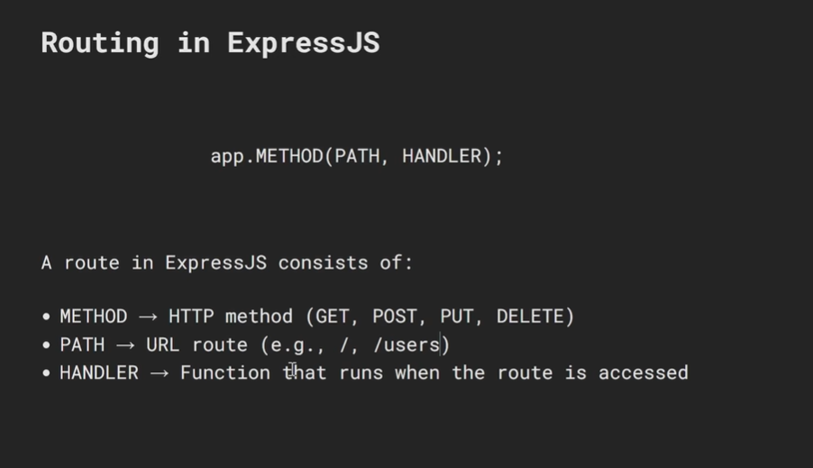

# Express.js — A Detailed Guide

---

## Table of Contents

1. [What is Express.js?](#1-what-is-expressjs)
2. [Installation & Project Setup](#2-installation--project-setup)
3. [Your First Express Server](#3-your-first-express-server)
4. [Routing](#4-routing)
5. [Route Parameters, Query Strings & Request Body](#5-route-parameters-query-strings--request-body)
6. [Middleware](#6-middleware)
7. [Built-in Middleware](#7-built-in-middleware)
8. [Third-Party Middleware](#8-third-party-middleware)
9. [Request & Response Objects](#9-request--response-objects)
10. [Serving Static Files](#10-serving-static-files)
11. [Template Engines](#11-template-engines)
12. [Express Router — Modular Routes](#12-express-router--modular-routes)
13. [Error Handling](#13-error-handling)
14. [REST API — Full Example](#14-rest-api--full-example)
15. [Environment Variables](#15-environment-variables)
16. [Project Structure (Best Practice)](#16-project-structure-best-practice)
17. [Quick Reference Cheatsheet](#17-quick-reference-cheatsheet)

---

## 1. What is Express.js?

**Express.js** is a minimal, fast, and unopinionated **web framework for Node.js**. It sits on top of Node's built-in `http` module and makes building servers dramatically easier.

### Without Express (raw Node.js)
```javascript
import http from "http";

const server = http.createServer((req, res) => {
  if (req.url === "/" && req.method === "GET") {
    res.writeHead(200, { "Content-Type": "text/plain" });
    res.end("Home page");
  } else if (req.url === "/about" && req.method === "GET") {
    res.writeHead(200, { "Content-Type": "text/plain" });
    res.end("About page");
  } else {
    res.writeHead(404);
    res.end("Not found");
  }
});

server.listen(3000);
```

### With Express
```javascript
import express from "express";
const app = express();

app.get("/",      (req, res) => res.send("Home page"));
app.get("/about", (req, res) => res.send("About page"));

app.listen(3000);
```

### What Express gives you
- Clean, readable **routing** (`app.get`, `app.post`, etc.)
- **Middleware** pipeline for processing requests
- Easy **JSON / form body parsing**
- **Static file** serving
- **Template engine** integration
- Robust **error handling**
- A massive ecosystem of compatible packages

---

## 2. Installation & Project Setup

```bash
# Initialize a new Node.js project
mkdir my-express-app
cd my-express-app
npm init -y

# Install Express
npm install express

# Optional but recommended packages
npm install dotenv          # environment variables
npm install nodemon --save-dev  # auto-restart on file changes
```

Add a dev script to `package.json`:
```json
{
  "type": "module",
  "scripts": {
    "start": "node server.js",
    "dev":   "nodemon server.js"
  }
}
```

Run the dev server:
```bash
npm run dev
```

---

## 3. Your First Express Server

```javascript
// server.js
import express from "express";

const app  = express();   // create an Express application instance
const PORT = 3000;

// Define a route — responds to GET requests at "/"
app.get("/", (req, res) => {
  res.send("Hello, Express!");
});

// Start listening for incoming connections
app.listen(PORT, () => {
  console.log(`Server running at http://localhost:${PORT}`);
});
```

### How it works

```
Client (Browser / Postman)
        │
        │  HTTP Request (GET /)
        ▼
  Express App (app.get("/"))
        │
        │  Matches the route
        ▼
  Route Handler (req, res) => { ... }
        │
        │  res.send("Hello!")
        ▼
  HTTP Response sent back to Client
```

---

## 4. Routing

Routing defines how your app responds to a client request at a specific **URL** and **HTTP method**.



### HTTP Methods

```javascript
app.get("/users",    (req, res) => res.send("GET    — fetch users"));
app.post("/users",   (req, res) => res.send("POST   — create user"));
app.put("/users",    (req, res) => res.send("PUT    — replace user"));
app.patch("/users",  (req, res) => res.send("PATCH  — update user"));
app.delete("/users", (req, res) => res.send("DELETE — remove user"));

// app.all() matches ALL HTTP methods for a path
app.all("/secret", (req, res) => {
  res.send(`You used method: ${req.method}`);
});
```

### Route Patterns

```javascript
// Exact match
app.get("/about", (req, res) => res.send("About"));

// Named parameters (covered in next section)
app.get("/users/:id", (req, res) => res.send(req.params.id));

// Optional parameter — matches /blog and /blog/123
app.get("/blog/:id?", (req, res) => {
  res.send(req.params.id ? `Post ${req.params.id}` : "All posts");
});

// Wildcard — matches /files/anything/here
app.get("/files/*", (req, res) => {
  res.send(`File path: ${req.params[0]}`);
});

// Regex pattern — matches /aab, /aaab, /aaaab etc.
app.get(/^\/a+b$/, (req, res) => res.send("Regex matched!"));
```

### Chaining Route Handlers

```javascript
// Multiple handlers for the same route using .route()
app.route("/posts")
  .get((req, res)    => res.send("Get all posts"))
  .post((req, res)   => res.send("Create a post"))
  .delete((req, res) => res.send("Delete all posts"));
```

---

## 5. Route Parameters, Query Strings & Request Body

### Route Parameters (`:param`)

Dynamic segments of a URL — captured as `req.params`.

```javascript
// URL: GET /users/42
app.get("/users/:id", (req, res) => {
  const { id } = req.params;
  res.json({ userId: id }); // → { "userId": "42" }
});

// Multiple params
// URL: GET /users/5/posts/12
app.get("/users/:userId/posts/:postId", (req, res) => {
  const { userId, postId } = req.params;
  res.json({ userId, postId }); // → { "userId": "5", "postId": "12" }
});
```

### Query Strings (`?key=value`)

Key-value pairs after the `?` — captured as `req.query`.

```javascript
// URL: GET /search?q=nodejs&page=2&limit=10
app.get("/search", (req, res) => {
  const { q, page = 1, limit = 10 } = req.query;
  res.json({ query: q, page, limit });
  // → { "query": "nodejs", "page": "2", "limit": "10" }
});
```

### Request Body (POST / PUT / PATCH)

Data sent in the body of a request — captured as `req.body`.  
Requires `express.json()` or `express.urlencoded()` middleware first.

```javascript
app.use(express.json()); // parse JSON bodies

// URL: POST /users
// Body: { "name": "Alice", "email": "alice@example.com" }
app.post("/users", (req, res) => {
  const { name, email } = req.body;
  res.status(201).json({ message: "User created", name, email });
});
```

---

## 6. Middleware

Middleware are **functions that run between the request and the response**. Each middleware has access to `req`, `res`, and `next`.

```
Request → Middleware 1 → Middleware 2 → Middleware 3 → Route Handler → Response
```

### Middleware Signature

```javascript
function myMiddleware(req, res, next) {
  // do something with req or res
  next(); // MUST call next() to pass control to the next middleware
          // If you don't call next(), the request will hang forever
}
```

### Types of Middleware

#### Application-level middleware — runs for ALL routes

```javascript
const app = express();

// Runs on every single request
app.use((req, res, next) => {
  console.log(`[${new Date().toISOString()}] ${req.method} ${req.url}`);
  next(); // pass to the next middleware or route
});
```

#### Path-specific middleware — runs only for matching paths

```javascript
// Only runs for routes starting with /admin
app.use("/admin", (req, res, next) => {
  console.log("Admin section accessed");
  next();
});
```

#### Route-level middleware — passed directly into a route

```javascript
// Authentication check middleware
function isAuthenticated(req, res, next) {
  const token = req.headers["authorization"];
  if (token === "secret-token") {
    next(); // authenticated — proceed
  } else {
    res.status(401).json({ error: "Unauthorized" });
    // Note: do NOT call next() here — we stop the chain
  }
}

// Apply middleware only to this specific route
app.get("/dashboard", isAuthenticated, (req, res) => {
  res.json({ message: "Welcome to the dashboard!" });
});
```

#### Multiple middlewares in a chain

```javascript
function logRequest(req, res, next) {
  console.log("Step 1: Logging request");
  next();
}

function validateInput(req, res, next) {
  console.log("Step 2: Validating input");
  next();
}

function sendResponse(req, res) {
  console.log("Step 3: Sending response");
  res.send("Done!");
}

app.get("/pipeline", logRequest, validateInput, sendResponse);
// → Step 1 → Step 2 → Step 3
```

---

## 7. Built-in Middleware

Express ships with several built-in middleware functions:

### `express.json()`

Parses incoming requests with **JSON bodies** (`Content-Type: application/json`).

```javascript
app.use(express.json());

app.post("/data", (req, res) => {
  console.log(req.body); // parsed JSON object
  res.json(req.body);
});
```

### `express.urlencoded()`

Parses incoming requests with **URL-encoded bodies** (HTML form submissions).

```javascript
// extended: true allows nested objects in form data
app.use(express.urlencoded({ extended: true }));

app.post("/form", (req, res) => {
  console.log(req.body); // { name: "Alice", email: "alice@example.com" }
  res.send("Form received!");
});
```

### `express.static()`

Serves **static files** (HTML, CSS, JS, images) from a directory.

```javascript
// Serves files from the "public" folder
app.use(express.static("public"));

// File: public/index.html → accessible at http://localhost:3000/index.html
// File: public/style.css  → accessible at http://localhost:3000/style.css
// File: public/logo.png   → accessible at http://localhost:3000/logo.png

// With a virtual prefix
app.use("/assets", express.static("public"));
// File: public/logo.png → http://localhost:3000/assets/logo.png
```

### `express.raw()` and `express.text()`

```javascript
app.use(express.raw());          // parses body as a Buffer
app.use(express.text());         // parses body as a plain string
```

---

## 8. Third-Party Middleware

### morgan — HTTP request logger

```bash
npm install morgan
```

```javascript
import morgan from "morgan";

app.use(morgan("dev")); // logs: GET /users 200 5.123 ms - 48
// Formats: "dev", "tiny", "short", "combined" (Apache log format)
```

### cors — Cross-Origin Resource Sharing

```bash
npm install cors
```

```javascript
import cors from "cors";

// Allow all origins
app.use(cors());

// Allow specific origin only
app.use(cors({
  origin: "https://yourfrontend.com",
  methods: ["GET", "POST", "PUT", "DELETE"],
}));
```

### helmet — Security headers

```bash
npm install helmet
```

```javascript
import helmet from "helmet";

app.use(helmet()); // sets 11 security-related HTTP headers automatically
```

### express-rate-limit — Rate limiting

```bash
npm install express-rate-limit
```

```javascript
import rateLimit from "express-rate-limit";

const limiter = rateLimit({
  windowMs: 15 * 60 * 1000, // 15 minutes
  max: 100,                  // max 100 requests per window per IP
  message: "Too many requests, please try again later.",
});

app.use("/api", limiter); // apply only to /api routes
```

### cookie-parser — Parse cookies

```bash
npm install cookie-parser
```

```javascript
import cookieParser from "cookie-parser";

app.use(cookieParser());

app.get("/set-cookie", (req, res) => {
  res.cookie("username", "Alice", { httpOnly: true, maxAge: 86400000 });
  res.send("Cookie set!");
});

app.get("/get-cookie", (req, res) => {
  console.log(req.cookies.username); // → "Alice"
  res.send(`Hello, ${req.cookies.username}`);
});
```

---

## 9. Request & Response Objects

### The Request Object (`req`)

```javascript
app.get("/example/:id", (req, res) => {
  // URL parameters
  console.log(req.params);        // { id: "42" }

  // Query string
  console.log(req.query);         // { page: "1", limit: "10" }

  // Request body (needs body-parser middleware)
  console.log(req.body);          // { name: "Alice" }

  // HTTP headers
  console.log(req.headers);       // { authorization: "Bearer token...", ... }
  console.log(req.get("host"));   // "localhost:3000"

  // HTTP method
  console.log(req.method);        // "GET"

  // Full URL path
  console.log(req.path);          // "/example/42"
  console.log(req.url);           // "/example/42?page=1"
  console.log(req.originalUrl);   // full URL including mounted path prefix

  // Client IP address
  console.log(req.ip);            // "::1" (localhost)

  // Protocol
  console.log(req.protocol);      // "http" or "https"

  // Checks
  console.log(req.secure);        // true if https
  console.log(req.xhr);           // true if AJAX request

  res.send("Check console!");
});
```

### The Response Object (`res`)

```javascript
app.get("/responses", (req, res) => {
  // Send a plain string or HTML
  res.send("Hello!");
  res.send("<h1>Hello!</h1>");

  // Send JSON — automatically sets Content-Type: application/json
  res.json({ message: "Success", data: [1, 2, 3] });

  // Send with a specific status code
  res.status(201).json({ message: "Created" });
  res.status(404).send("Not Found");

  // Redirect to another URL
  res.redirect("/new-url");
  res.redirect(301, "/permanent-redirect"); // 301 = permanent, 302 = temporary

  // Send a file for download
  res.download("./files/report.pdf");               // prompts download
  res.download("./files/report.pdf", "My Report.pdf"); // custom download filename

  // Send a file as response (inline, not download)
  res.sendFile("/absolute/path/to/file.html");

  // Set response headers
  res.set("X-Custom-Header", "myvalue");
  res.set({ "X-Foo": "bar", "X-Baz": "qux" });

  // Set a cookie
  res.cookie("token", "abc123", { httpOnly: true });

  // Clear a cookie
  res.clearCookie("token");

  // End response with no body
  res.end();
  res.sendStatus(204); // 204 No Content
});
```

---

## 10. Serving Static Files

```javascript
import path from "path";
import { fileURLToPath } from "url";

const __dirname = path.dirname(fileURLToPath(import.meta.url));

// Serve from a "public" folder
app.use(express.static(path.join(__dirname, "public")));

/*
  public/
  ├── index.html     → http://localhost:3000/
  ├── about.html     → http://localhost:3000/about.html
  ├── css/
  │   └── style.css  → http://localhost:3000/css/style.css
  └── images/
      └── logo.png   → http://localhost:3000/images/logo.png
*/

// Multiple static directories (searched in order)
app.use(express.static("public"));
app.use(express.static("uploads"));
```

---

## 11. Template Engines

Template engines let you render dynamic HTML on the server.  
Popular options: **EJS**, **Pug**, **Handlebars**.

### Using EJS

```bash
npm install ejs
```

```javascript
app.set("view engine", "ejs");           // set EJS as the engine
app.set("views", "./views");             // folder where templates live

app.get("/profile", (req, res) => {
  // Renders views/profile.ejs and passes data to it
  res.render("profile", {
    name:  "Alice",
    age:   28,
    skills: ["JavaScript", "Node.js", "Express"],
  });
});
```

```html
<!-- views/profile.ejs -->
<!DOCTYPE html>
<html>
<body>
  <h1>Hello, <%= name %>!</h1>       <!-- outputs: Hello, Alice! -->
  <p>Age: <%= age %></p>

  <ul>
    <% skills.forEach(skill => { %>  <!-- loop over array -->
      <li><%= skill %></li>
    <% }) %>
  </ul>
</body>
</html>
```

---

## 12. Express Router — Modular Routes

As your app grows, keeping all routes in one file becomes messy.  
`express.Router()` lets you split routes into separate files.

### Folder structure

```
project/
├── server.js
└── routes/
    ├── users.js
    └── posts.js
```

### routes/users.js

```javascript
import { Router } from "express";
const router = Router();

// All paths here are RELATIVE to where this router is mounted
router.get("/",        (req, res) => res.json({ message: "Get all users" }));
router.get("/:id",     (req, res) => res.json({ message: `Get user ${req.params.id}` }));
router.post("/",       (req, res) => res.status(201).json({ message: "Create user" }));
router.put("/:id",     (req, res) => res.json({ message: `Update user ${req.params.id}` }));
router.delete("/:id",  (req, res) => res.json({ message: `Delete user ${req.params.id}` }));

export default router;
```

### routes/posts.js

```javascript
import { Router } from "express";
const router = Router();

router.get("/",    (req, res) => res.json({ message: "Get all posts" }));
router.get("/:id", (req, res) => res.json({ message: `Get post ${req.params.id}` }));
router.post("/",   (req, res) => res.status(201).json({ message: "Create post" }));

export default router;
```

### server.js — mount the routers

```javascript
import express from "express";
import usersRouter from "./routes/users.js";
import postsRouter from "./routes/posts.js";

const app = express();
app.use(express.json());

// Mount routers at a base path
app.use("/users", usersRouter); // /users, /users/:id
app.use("/posts", postsRouter); // /posts, /posts/:id

app.listen(3000, () => console.log("Server running on port 3000"));

/*
  Final routes:
  GET    /users          → get all users
  GET    /users/:id      → get user by id
  POST   /users          → create user
  PUT    /users/:id      → update user
  DELETE /users/:id      → delete user
  GET    /posts          → get all posts
  GET    /posts/:id      → get post by id
  POST   /posts          → create post
*/
```

---

## 13. Error Handling

### Basic Error Handling

```javascript
// Any route that needs to signal an error calls next(err)
app.get("/crash", (req, res, next) => {
  try {
    throw new Error("Something went wrong!");
  } catch (err) {
    next(err); // pass the error to Express's error handler
  }
});

// Async errors — must explicitly catch and call next(err)
app.get("/async-crash", async (req, res, next) => {
  try {
    const data = await someAsyncOperation();
    res.json(data);
  } catch (err) {
    next(err);
  }
});
```

### Error-Handling Middleware

Error-handling middleware has **4 parameters** — `(err, req, res, next)`.  
It must be defined **after** all other routes and middleware.

```javascript
// Global error handler — must be the LAST app.use()
app.use((err, req, res, next) => {
  console.error(err.stack);

  // Respond based on error type
  const statusCode = err.statusCode || 500;
  const message    = err.message    || "Internal Server Error";

  res.status(statusCode).json({
    error:   message,
    stack:   process.env.NODE_ENV === "development" ? err.stack : undefined,
  });
});
```

### Custom Error Class

```javascript
// A reusable custom error class
class AppError extends Error {
  constructor(message, statusCode) {
    super(message);
    this.statusCode = statusCode;
    this.name = "AppError";
  }
}

app.get("/users/:id", (req, res, next) => {
  const user = findUser(req.params.id); // hypothetical DB call

  if (!user) {
    return next(new AppError("User not found", 404));
  }

  res.json(user);
});

// Error handler will now receive our AppError with the right statusCode
app.use((err, req, res, next) => {
  res.status(err.statusCode || 500).json({ error: err.message });
});
```

### 404 Handler — catch undefined routes

```javascript
// Place this AFTER all routes but BEFORE the error handler
app.use((req, res, next) => {
  res.status(404).json({ error: `Route ${req.method} ${req.url} not found` });
});
```

---

## 14. REST API — Full Example

A complete CRUD REST API for a "todos" resource:

```javascript
// server.js
import express from "express";

const app  = express();
const PORT = 3000;

app.use(express.json());

// In-memory data store (use a database in production)
let todos = [
  { id: 1, title: "Learn Node.js",   done: true  },
  { id: 2, title: "Learn Express",   done: false },
  { id: 3, title: "Build a REST API",done: false },
];
let nextId = 4;

// Helper — find todo or return 404
function findTodo(id, res) {
  const todo = todos.find(t => t.id === Number(id));
  if (!todo) {
    res.status(404).json({ error: "Todo not found" });
    return null;
  }
  return todo;
}

// GET /todos — fetch all todos (supports ?done=true filter)
app.get("/todos", (req, res) => {
  const { done } = req.query;
  const result = done !== undefined
    ? todos.filter(t => t.done === (done === "true"))
    : todos;
  res.json(result);
});

// GET /todos/:id — fetch a single todo
app.get("/todos/:id", (req, res) => {
  const todo = findTodo(req.params.id, res);
  if (todo) res.json(todo);
});

// POST /todos — create a new todo
app.post("/todos", (req, res) => {
  const { title } = req.body;

  if (!title) {
    return res.status(400).json({ error: "Title is required" });
  }

  const newTodo = { id: nextId++, title, done: false };
  todos.push(newTodo);
  res.status(201).json(newTodo);
});

// PUT /todos/:id — replace a todo entirely
app.put("/todos/:id", (req, res) => {
  const todo = findTodo(req.params.id, res);
  if (!todo) return;

  const { title, done } = req.body;
  if (!title) return res.status(400).json({ error: "Title is required" });

  todo.title = title;
  todo.done  = done ?? todo.done;
  res.json(todo);
});

// PATCH /todos/:id — update specific fields only
app.patch("/todos/:id", (req, res) => {
  const todo = findTodo(req.params.id, res);
  if (!todo) return;

  // Only update fields that were actually sent
  if (req.body.title !== undefined) todo.title = req.body.title;
  if (req.body.done  !== undefined) todo.done  = req.body.done;

  res.json(todo);
});

// DELETE /todos/:id — delete a todo
app.delete("/todos/:id", (req, res) => {
  const index = todos.findIndex(t => t.id === Number(req.params.id));

  if (index === -1) {
    return res.status(404).json({ error: "Todo not found" });
  }

  todos.splice(index, 1);
  res.status(204).send(); // 204 = No Content (deleted successfully)
});

// 404 handler
app.use((req, res) => {
  res.status(404).json({ error: "Route not found" });
});

// Global error handler
app.use((err, req, res, next) => {
  console.error(err.stack);
  res.status(500).json({ error: "Internal Server Error" });
});

app.listen(PORT, () => {
  console.log(`Todo API running at http://localhost:${PORT}`);
});
```

### API Endpoints Summary

| Method | URL | Description |
|---|---|---|
| GET | `/todos` | Get all todos |
| GET | `/todos?done=true` | Get completed todos |
| GET | `/todos/:id` | Get a single todo |
| POST | `/todos` | Create a new todo |
| PUT | `/todos/:id` | Replace a todo |
| PATCH | `/todos/:id` | Update specific fields |
| DELETE | `/todos/:id` | Delete a todo |

---

## 15. Environment Variables

Never hardcode secrets (DB passwords, API keys, port numbers) in your code.

```bash
npm install dotenv
```

```
# .env  (add to .gitignore — never commit this!)
PORT=3000
NODE_ENV=development
DB_URI=mongodb://localhost:27017/mydb
JWT_SECRET=supersecretkey123
```

```javascript
// server.js — import dotenv at the very top
import "dotenv/config";

const PORT       = process.env.PORT       || 3000;
const NODE_ENV   = process.env.NODE_ENV   || "production";
const DB_URI     = process.env.DB_URI;
const JWT_SECRET = process.env.JWT_SECRET;

console.log(`Running in ${NODE_ENV} mode on port ${PORT}`);
```

---

## 16. Project Structure (Best Practice)

For a real-world Express application:

```
project/
├── server.js              ← entry point — starts the server
├── app.js                 ← express app setup — routes, middleware
├── .env                   ← environment variables (never commit!)
├── .gitignore
├── package.json
│
├── routes/                ← one file per resource
│   ├── users.js
│   ├── posts.js
│   └── auth.js
│
├── controllers/           ← business logic, separated from routing
│   ├── userController.js
│   └── postController.js
│
├── middleware/            ← custom middleware
│   ├── auth.js            ← authentication check
│   ├── logger.js          ← request logging
│   └── errorHandler.js    ← global error handler
│
├── models/                ← database schemas (Mongoose, Sequelize, etc.)
│   ├── User.js
│   └── Post.js
│
├── public/                ← static files (HTML, CSS, images)
│   ├── index.html
│   └── css/
│
└── views/                 ← template engine files (EJS, Pug, etc.)
    └── profile.ejs
```

### app.js — separated from server.js

```javascript
// app.js — configure express (no server.listen here)
import express from "express";
import morgan  from "morgan";
import cors    from "cors";
import usersRouter from "./routes/users.js";
import errorHandler from "./middleware/errorHandler.js";

const app = express();

// Middleware
app.use(cors());
app.use(morgan("dev"));
app.use(express.json());
app.use(express.static("public"));

// Routes
app.use("/api/users", usersRouter);

// 404 and error handling
app.use((req, res) => res.status(404).json({ error: "Not found" }));
app.use(errorHandler);

export default app;
```

```javascript
// server.js — only starts the server
import "dotenv/config";
import app from "./app.js";

const PORT = process.env.PORT || 3000;
app.listen(PORT, () => console.log(`Server on port ${PORT}`));
```

---

## 17. Quick Reference Cheatsheet

```
┌──────────────────────────────────────────────────────────┐
│                    ROUTING                               │
├──────────────────────────────────────────────────────────┤
│  app.get(path, handler)       GET request                │
│  app.post(path, handler)      POST request               │
│  app.put(path, handler)       PUT request                │
│  app.patch(path, handler)     PATCH request              │
│  app.delete(path, handler)    DELETE request             │
│  app.all(path, handler)       All HTTP methods           │
│  app.use(path?, middleware)   Mount middleware            │
│  app.route(path)              Chain multiple methods     │
└──────────────────────────────────────────────────────────┘

┌──────────────────────────────────────────────────────────┐
│                    REQUEST (req)                         │
├──────────────────────────────────────────────────────────┤
│  req.params        Route parameters (/users/:id)        │
│  req.query         Query strings (?page=1)              │
│  req.body          Request body (needs middleware)       │
│  req.headers       HTTP headers                          │
│  req.method        HTTP method (GET, POST...)            │
│  req.path          URL path (/users/42)                  │
│  req.ip            Client IP address                     │
│  req.get(name)     Get a specific header                 │
└──────────────────────────────────────────────────────────┘

┌──────────────────────────────────────────────────────────┐
│                   RESPONSE (res)                         │
├──────────────────────────────────────────────────────────┤
│  res.send(data)          Send string/HTML/Buffer         │
│  res.json(obj)           Send JSON response              │
│  res.status(code)        Set HTTP status code            │
│  res.redirect(url)       Redirect to URL                 │
│  res.render(view, data)  Render a template               │
│  res.sendFile(path)      Send a file inline              │
│  res.download(path)      Prompt file download            │
│  res.set(header, value)  Set a response header           │
│  res.cookie(name, val)   Set a cookie                    │
│  res.sendStatus(code)    Send status with default body   │
└──────────────────────────────────────────────────────────┘

┌──────────────────────────────────────────────────────────┐
│              BUILT-IN MIDDLEWARE                         │
├──────────────────────────────────────────────────────────┤
│  express.json()                Parse JSON bodies         │
│  express.urlencoded()          Parse form bodies         │
│  express.static(dir)           Serve static files        │
└──────────────────────────────────────────────────────────┘

┌──────────────────────────────────────────────────────────┐
│              HTTP STATUS CODES                           │
├──────────────────────────────────────────────────────────┤
│  200 OK               Request succeeded                  │
│  201 Created          Resource was created               │
│  204 No Content       Success, no body (e.g. DELETE)     │
│  301 Moved            Permanent redirect                 │
│  302 Found            Temporary redirect                 │
│  400 Bad Request      Invalid input from client          │
│  401 Unauthorized     Not authenticated                  │
│  403 Forbidden        Authenticated but not allowed      │
│  404 Not Found        Resource doesn't exist             │
│  409 Conflict         Duplicate / state conflict         │
│  422 Unprocessable    Validation failed                  │
│  500 Server Error     Unexpected server-side error       │
└──────────────────────────────────────────────────────────┘
```

---

> **Summary:** Express.js is the most widely used Node.js web framework because it stays out of your way — it gives you routing, middleware, and request/response helpers without forcing a specific architecture. Start small with a single `server.js`, then grow into routers, controllers, and models as your app scales.