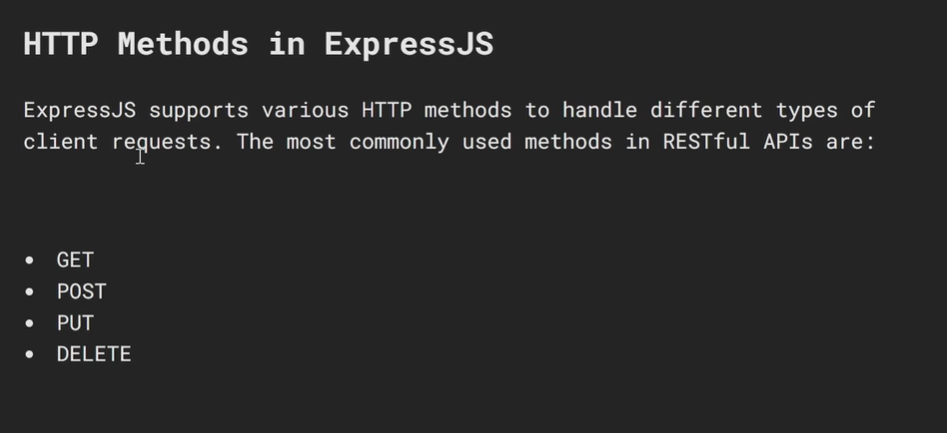
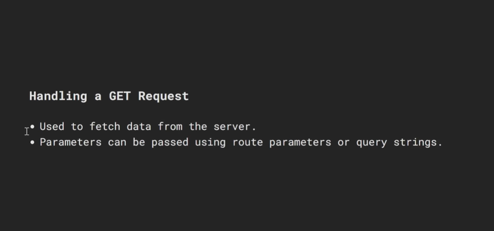
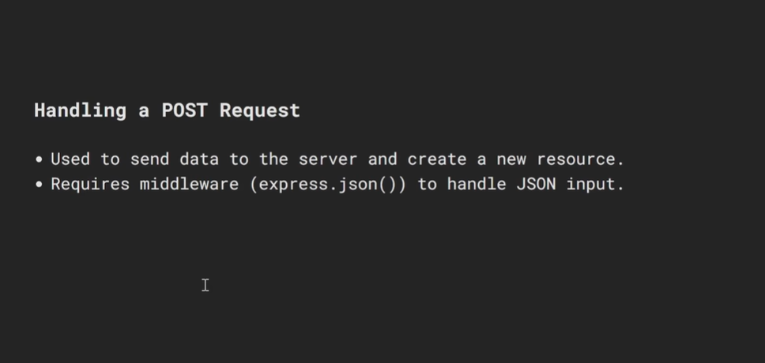
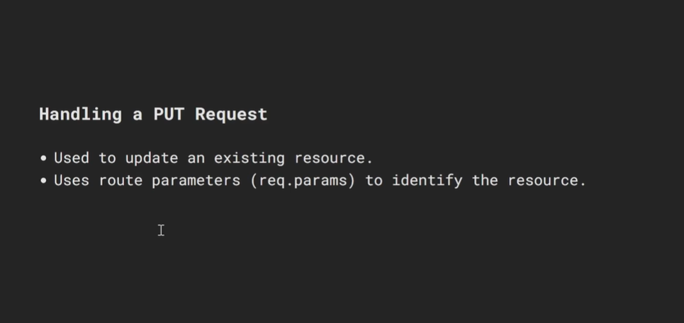
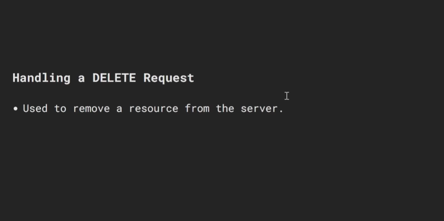

# HTTP Methods in Express.js — A Detailed Guide

---

## Table of Contents

1. [What are HTTP Methods?](#1-what-are-http-methods)
2. [The 5 Core HTTP Methods](#2-the-5-core-http-methods)
3. [GET — Fetch Data](#3-get--fetch-data)
4. [POST — Create Data](#4-post--create-data)
5. [PUT — Replace Data](#5-put--replace-data)
6. [PATCH — Update Data](#6-patch--update-data)
7. [DELETE — Remove Data](#7-delete--remove-data)
8. [PUT vs PATCH — Key Difference](#8-put-vs-patch--key-difference)
9. [app.all() — Match All Methods](#9-appall--match-all-methods)
10. [app.route() — Chain Methods on One Path](#10-approute--chain-methods-on-one-path)
11. [Sending Data to the Server](#11-sending-data-to-the-server)
12. [HTTP Status Codes per Method](#12-http-status-codes-per-method)
13. [Full REST API Example](#13-full-rest-api-example)
14. [Testing with curl](#14-testing-with-curl)
15. [Quick Reference Cheatsheet](#15-quick-reference-cheatsheet)

---

## 1. What are HTTP Methods?

An **HTTP method** (also called an HTTP verb) tells the server **what action** the client wants to perform on a resource.

```
HTTP Request = METHOD + URL + Headers + (optional Body)

  GET    /users          → "give me all users"
  POST   /users          → "create a new user"
  PUT    /users/1        → "replace user with id 1"
  PATCH  /users/1        → "update some fields of user 1"
  DELETE /users/1        → "delete user with id 1"
```

### The REST convention

REST (Representational State Transfer) is a standard convention that maps HTTP methods to **CRUD operations**:

```
┌──────────────┬────────────┬───────────────────────────────────┐
│ HTTP Method  │ CRUD       │ Meaning                           │
├──────────────┼────────────┼───────────────────────────────────┤
│ GET          │ Read       │ Fetch one or many resources       │
│ POST         │ Create     │ Create a new resource             │
│ PUT          │ Replace    │ Replace an entire resource        │
│ PATCH        │ Update     │ Update specific fields only       │
│ DELETE       │ Delete     │ Remove a resource                 │
└──────────────┴────────────┴───────────────────────────────────┘
```

### How Express handles methods

In Express, every HTTP method has a matching function on the `app` object:

```javascript
app.get(path, handler)
app.post(path, handler)
app.put(path, handler)
app.patch(path, handler)
app.delete(path, handler)
app.all(path, handler)     // matches ALL methods
```

---

## 2. The 5 Core HTTP Methods

### Visual overview

```
┌──────────────────────────────────────────────────────────────────┐
│                     /users resource                              │
├──────────────┬───────────────────────────────────────────────────┤
│ GET /users   │ Returns a list of all users                       │
│ POST /users  │ Creates a brand new user                          │
├──────────────┴───────────────────────────────────────────────────┤
│                     /users/:id resource                          │
├──────────────┬───────────────────────────────────────────────────┤
│ GET    /users/:id │ Returns one specific user                    │
│ PUT    /users/:id │ Replaces the entire user object              │
│ PATCH  /users/:id │ Updates only specific fields of the user     │
│ DELETE /users/:id │ Permanently removes the user                 │
└──────────────┴───────────────────────────────────────────────────┘
```

### Safe vs Unsafe methods

```
┌───────────────┬────────┬───────────────────────────────────────┐
│ Method        │ Safe?  │ Meaning                               │
├───────────────┼────────┼───────────────────────────────────────┤
│ GET           │ ✅ Yes  │ Never changes data on the server      │
│ POST          │ ❌ No   │ Creates new data                      │
│ PUT           │ ❌ No   │ Replaces existing data                │
│ PATCH         │ ❌ No   │ Modifies existing data                │
│ DELETE        │ ❌ No   │ Removes data                          │
└───────────────┴────────┴───────────────────────────────────────┘
```

### Idempotent methods

An operation is **idempotent** if calling it multiple times produces the same result as calling it once.

```
┌───────────────┬──────────────┬──────────────────────────────────┐
│ Method        │ Idempotent?  │ Why                              │
├───────────────┼──────────────┼──────────────────────────────────┤
│ GET           │ ✅ Yes        │ Just reads — same result always  │
│ PUT           │ ✅ Yes        │ Replaces with same data          │
│ DELETE        │ ✅ Yes        │ Deleting twice = same end state  │
│ PATCH         │ ⚠️ Sometimes  │ Depends on implementation        │
│ POST          │ ❌ No         │ Creates a NEW resource each time │
└───────────────┴──────────────┴──────────────────────────────────┘
```

---

## 3. GET — Fetch Data

`GET` is used to **retrieve data** from the server. It should never modify data.

### Rules for GET
- No request body (data goes in URL params or query string)
- Safe and idempotent
- Response should be cached when possible

### GET all resources

```javascript
// In-memory data store (simulates a DB)
let users = [
  { id: 1, name: "Alice", email: "alice@example.com", role: "admin" },
  { id: 2, name: "John",  email: "john@example.com",  role: "user"  },
  { id: 3, name: "Bob",   email: "bob@example.com",   role: "user"  },
];

// GET /users
// Returns all users (with optional ?role= filter)
//
// Example requests:
//   GET /users          → all users
//   GET /users?role=admin → only admins
app.get("/users", (req, res) => {
  const { role } = req.query;

  // If a ?role= filter was provided, filter the results
  const result = role
    ? users.filter(u => u.role === role)
    : users;

  res.json(result);
  // Response: 200 OK + array of user objects
});
```

### GET a single resource by ID

```javascript
// GET /users/:id
// :id is a route parameter — matches any value in that URL segment
//
// Example requests:
//   GET /users/1   → returns Alice
//   GET /users/99  → returns 404
app.get("/users/:id", (req, res) => {
  // req.params.id is always a STRING even if the URL has a number
  const id = Number(req.params.id);

  const user = users.find(u => u.id === id);

  if (!user) {
    // Resource not found — respond with 404
    return res.status(404).json({ error: `User with ID ${id} not found` });
  }

  res.json(user);
  // Response: 200 OK + user object
});
```

### GET with multiple query parameters

```javascript
// GET /users/search
//
// Example: GET /users/search?name=alice&role=admin
app.get("/users/search", (req, res) => {
  const { name, role, page = 1, limit = 10 } = req.query;

  let result = [...users];

  if (name) result = result.filter(u =>
    u.name.toLowerCase().includes(name.toLowerCase())
  );

  if (role) result = result.filter(u => u.role === role);

  // Pagination
  const start = (Number(page) - 1) * Number(limit);
  const end   = start + Number(limit);
  const paginated = result.slice(start, end);

  res.json({
    total:   result.length,
    page:    Number(page),
    limit:   Number(limit),
    data:    paginated,
  });
});
```

---

## 4. POST — Create Data

`POST` is used to **create a new resource** on the server. Data is sent in the **request body**.

### Rules for POST
- Always include `express.json()` middleware to parse the body
- NOT idempotent — calling it twice creates two resources
- Returns `201 Created` on success (not 200)
- Should return the newly created resource in the response

### Basic POST

```javascript
app.use(express.json()); // REQUIRED — parses JSON request body into req.body

let nextId = 4; // auto-increment ID (use DB auto-increment in production)

// POST /users
// Body: { "name": "Diana", "email": "diana@example.com", "role": "user" }
app.post("/users", (req, res) => {
  const { name, email, role } = req.body;

  // Input validation — always validate before saving
  if (!name || !email) {
    return res.status(400).json({
      error: "Both 'name' and 'email' are required fields"
    });
  }

  // Check for duplicate email
  const existing = users.find(u => u.email === email);
  if (existing) {
    return res.status(409).json({ error: "A user with this email already exists" });
  }

  // Build the new user object
  const newUser = {
    id:    nextId++,        // assign next available ID
    name:  name.trim(),     // trim whitespace
    email: email.trim().toLowerCase(),
    role:  role || "user",  // default role if not provided
  };

  users.push(newUser);      // save to data store

  // 201 Created — include the new user in the response
  // so the client knows the assigned ID and final values
  res.status(201).json(newUser);
});
```

---

## 5. PUT — Replace Data

`PUT` is used to **completely replace** an existing resource. You must send ALL fields — any field you omit gets overwritten with `undefined` or a default.

### Rules for PUT
- Sends ALL fields of the resource (complete replacement)
- Idempotent — doing it multiple times gives the same result
- Returns `200 OK` with the updated resource
- Returns `404` if the resource doesn't exist

```javascript
// PUT /users/:id
// Body: { "name": "Alice Updated", "email": "alice_new@example.com", "role": "admin" }
//
// ALL fields must be sent — this REPLACES the entire user object
app.put("/users/:id", (req, res) => {
  const id   = Number(req.params.id);
  const index = users.findIndex(u => u.id === id);

  if (index === -1) {
    return res.status(404).json({ error: `User with ID ${id} not found` });
  }

  const { name, email, role } = req.body;

  // Validate all required fields are present
  if (!name || !email || !role) {
    return res.status(400).json({
      error: "PUT requires all fields: 'name', 'email', and 'role'"
    });
  }

  // REPLACE the entire user object (keep the same id)
  const updatedUser = {
    id,                            // preserve the original ID
    name:  name.trim(),
    email: email.trim().toLowerCase(),
    role,
  };

  users[index] = updatedUser;      // replace in array

  res.json(updatedUser);
  // Response: 200 OK + full updated user
});
```

---

## 6. PATCH — Update Data

`PATCH` is used to **partially update** a resource. You only send the fields you want to change — everything else stays the same.

### Rules for PATCH
- Only send the fields you want to update (partial update)
- More flexible than PUT for small changes
- Returns `200 OK` with the updated resource

```javascript
// PATCH /users/:id
// Body examples:
//   { "name": "Alice Smith" }                    → only update name
//   { "role": "admin" }                          → only update role
//   { "name": "Alice", "email": "a@b.com" }      → update two fields
//
// Fields NOT included in the body remain UNCHANGED
app.patch("/users/:id", (req, res) => {
  const id   = Number(req.params.id);
  const user = users.find(u => u.id === id);

  if (!user) {
    return res.status(404).json({ error: `User with ID ${id} not found` });
  }

  // Guard: reject empty body — nothing to update
  if (!req.body || Object.keys(req.body).length === 0) {
    return res.status(400).json({ error: "Request body cannot be empty for PATCH" });
  }

  // Only update fields that were actually sent in the request body
  // Fields not in req.body keep their original values
  if (req.body.name  !== undefined) user.name  = req.body.name.trim();
  if (req.body.email !== undefined) user.email = req.body.email.trim().toLowerCase();
  if (req.body.role  !== undefined) user.role  = req.body.role;

  res.json(user);
  // Response: 200 OK + updated user (with unchanged fields still present)
});
```

---

## 7. DELETE — Remove Data

`DELETE` is used to **permanently remove** a resource from the server.

### Rules for DELETE
- No request body (the ID is in the URL)
- Idempotent — deleting twice gives the same end state (resource is gone)
- Returns `204 No Content` on success (no body needed)
- Returns `404` if the resource doesn't exist

```javascript
// DELETE /users/:id
//
// Example: DELETE /users/2 → removes user with id 2
app.delete("/users/:id", (req, res) => {
  const id    = Number(req.params.id);
  const index = users.findIndex(u => u.id === id);

  if (index === -1) {
    return res.status(404).json({ error: `User with ID ${id} not found` });
  }

  const deleted = users[index];     // save reference before removing
  users.splice(index, 1);           // remove from array

  // 204 No Content — success but no body to return
  // (some APIs return the deleted object instead — both are acceptable)
  res.status(204).send();

  // Alternative — return deleted object so client knows what was removed:
  // res.json({ message: "User deleted", user: deleted });
});
```

---

## 8. PUT vs PATCH — Key Difference

This is one of the most commonly confused concepts. Here's a concrete example:

### Starting data

```json
{ "id": 1, "name": "Alice", "email": "alice@example.com", "role": "admin" }
```

### Scenario: you only want to update the role to "user"

#### Using PUT (wrong approach for partial update)

```javascript
// PUT /users/1
// Body: { "role": "user" }          ← only sending role
//
// Result: ❌
// { "id": 1, "name": undefined, "email": undefined, "role": "user" }
// PUT REPLACES the whole object — missing fields become undefined/null!
```

#### Using PATCH (correct approach for partial update)

```javascript
// PATCH /users/1
// Body: { "role": "user" }          ← only sending role
//
// Result: ✅
// { "id": 1, "name": "Alice", "email": "alice@example.com", "role": "user" }
// PATCH only touches the fields you send — everything else stays intact
```

### Decision guide

```
Updating ONE or FEW fields?      → Use PATCH
Replacing the ENTIRE resource?   → Use PUT
Not sure?                        → Default to PATCH (safer)
```

---

## 9. app.all() — Match All Methods

`app.all()` registers a handler that runs for **every HTTP method** on a given path. Useful for middleware that should apply to a specific route regardless of method.

```javascript
// Runs for GET, POST, PUT, PATCH, DELETE /secret — any method
app.all("/secret", (req, res, next) => {
  console.log(`Accessing /secret via ${req.method}`);

  // Example: check for an API key on all methods
  const apiKey = req.headers["x-api-key"];
  if (!apiKey || apiKey !== "my-secret-key") {
    return res.status(403).json({ error: "Invalid API key" });
  }

  next(); // key is valid — proceed to the actual route handler
});

// This GET /secret handler only runs if the app.all() middleware calls next()
app.get("/secret", (req, res) => {
  res.json({ data: "Secret content unlocked!" });
});
```

---

## 10. app.route() — Chain Methods on One Path

`app.route()` lets you chain multiple HTTP method handlers for the **same URL path**, keeping related routes grouped together and avoiding repetition.

```javascript
// Without app.route() — path "/users" repeated three times
app.get("/users",    getAllUsers);
app.post("/users",   createUser);
app.delete("/users", deleteAllUsers);

// With app.route() — path "/users" written once, methods chained
app.route("/users")
  .get((req, res)    => res.json(users))          // GET /users
  .post((req, res)   => {                         // POST /users
    const user = req.body;
    users.push(user);
    res.status(201).json(user);
  })
  .delete((req, res) => {                         // DELETE /users
    users = [];
    res.status(204).send();
  });

// Same pattern for a parameterised path
app.route("/users/:id")
  .get((req, res)   => {                          // GET /users/:id
    const user = users.find(u => u.id === Number(req.params.id));
    user ? res.json(user) : res.status(404).json({ error: "Not found" });
  })
  .put((req, res)   => res.json({ method: "PUT",   id: req.params.id }))
  .patch((req, res) => res.json({ method: "PATCH", id: req.params.id }))
  .delete((req, res)=> res.status(204).send());
```

---

## 11. Sending Data to the Server

Different methods send data in different parts of the HTTP request:

### Via URL — Route Parameters

```javascript
// Data embedded directly in the URL path
// Used to identify a specific resource

app.get("/users/:id", (req, res) => {
  console.log(req.params.id); // "42"  ← from URL /users/42
});
```

### Via URL — Query String

```javascript
// Data appended after ? in the URL
// Used for filtering, sorting, pagination — always optional

// URL: GET /users?role=admin&page=2&limit=5
app.get("/users", (req, res) => {
  console.log(req.query);
  // → { role: "admin", page: "2", limit: "5" }
  // Note: ALL query values are STRINGS — convert with Number() if needed
});
```

### Via Request Body — JSON

```javascript
// Data sent inside the HTTP request body
// Used for POST, PUT, PATCH — when sending structured data

app.use(express.json()); // parse JSON bodies — MUST come before routes

// Body: { "name": "Alice", "email": "alice@example.com" }
app.post("/users", (req, res) => {
  console.log(req.body);
  // → { name: "Alice", email: "alice@example.com" }
});
```

### Via Request Body — Form Data

```javascript
// Data sent from an HTML <form> submission
// Content-Type: application/x-www-form-urlencoded

app.use(express.urlencoded({ extended: true }));

app.post("/form", (req, res) => {
  console.log(req.body); // → { name: "Alice", email: "alice@example.com" }
});
```

### Via Headers

```javascript
// Data sent in HTTP headers
// Used for: Authorization tokens, API keys, Content-Type, custom headers

app.get("/protected", (req, res) => {
  const auth   = req.headers["authorization"]; // "Bearer token123"
  const apiKey = req.headers["x-api-key"];     // custom header
  const agent  = req.get("User-Agent");         // req.get() is a shorthand

  console.log({ auth, apiKey, agent });
  res.json({ message: "Headers received" });
});
```

### Summary — where each method sends data

```
┌────────────────┬──────────────────────────────────────────────┐
│ Method         │ Where data goes                              │
├────────────────┼──────────────────────────────────────────────┤
│ GET            │ URL params (:id) + query string (?key=val)   │
│ POST           │ Request body (JSON or form data)             │
│ PUT            │ URL params for ID + body for all new data    │
│ PATCH          │ URL params for ID + body for changed fields  │
│ DELETE         │ URL params for ID (no body needed)           │
└────────────────┴──────────────────────────────────────────────┘
```

---

## 12. HTTP Status Codes per Method

Always return the right status code — it communicates the result clearly to the client.

```
┌────────────────┬──────────────────────────────────────────────────────┐
│ Scenario       │ Status Code                                          │
├────────────────┼──────────────────────────────────────────────────────┤
│ GET success    │ 200 OK                                               │
│ POST success   │ 201 Created                                          │
│ PUT success    │ 200 OK                                               │
│ PATCH success  │ 200 OK                                               │
│ DELETE success │ 204 No Content (no body) OR 200 OK (with body)       │
├────────────────┼──────────────────────────────────────────────────────┤
│ Not found      │ 404 Not Found                                        │
│ Bad input      │ 400 Bad Request                                      │
│ Duplicate      │ 409 Conflict                                         │
│ No auth token  │ 401 Unauthorized                                     │
│ Not allowed    │ 403 Forbidden                                        │
│ Server crash   │ 500 Internal Server Error                            │
└────────────────┴──────────────────────────────────────────────────────┘
```

---

## 13. Full REST API Example

A complete working example combining all 5 methods for a `users` resource:

```javascript
import express from "express";

const app = express();
app.use(express.json()); // parse JSON bodies

let users = [
  { id: 1, name: "Alice", email: "alice@example.com", role: "admin" },
  { id: 2, name: "John",  email: "john@example.com",  role: "user"  },
  { id: 3, name: "Bob",   email: "bob@example.com",   role: "user"  },
];
let nextId = 4;

// Helper — find user or respond 404
function findUser(id, res) {
  const user = users.find(u => u.id === Number(id));
  if (!user) res.status(404).json({ error: `User ${id} not found` });
  return user || null;
}

// ── GET /users ───────────────────────────────────────────────
app.get("/users", (req, res) => {
  const { role } = req.query;
  const result = role ? users.filter(u => u.role === role) : users;
  res.json(result);
});

// ── GET /users/:id ───────────────────────────────────────────
app.get("/users/:id", (req, res) => {
  const user = findUser(req.params.id, res);
  if (user) res.json(user);
});

// ── POST /users ──────────────────────────────────────────────
app.post("/users", (req, res) => {
  const { name, email, role } = req.body;

  if (!name || !email)
    return res.status(400).json({ error: "name and email are required" });

  if (users.find(u => u.email === email))
    return res.status(409).json({ error: "Email already exists" });

  const newUser = { id: nextId++, name, email, role: role || "user" };
  users.push(newUser);
  res.status(201).json(newUser);
});

// ── PUT /users/:id ───────────────────────────────────────────
app.put("/users/:id", (req, res) => {
  const index = users.findIndex(u => u.id === Number(req.params.id));
  if (index === -1)
    return res.status(404).json({ error: "User not found" });

  const { name, email, role } = req.body;
  if (!name || !email || !role)
    return res.status(400).json({ error: "PUT requires name, email, and role" });

  users[index] = { id: Number(req.params.id), name, email, role };
  res.json(users[index]);
});

// ── PATCH /users/:id ─────────────────────────────────────────
app.patch("/users/:id", (req, res) => {
  const user = findUser(req.params.id, res);
  if (!user) return;

  if (req.body.name  !== undefined) user.name  = req.body.name;
  if (req.body.email !== undefined) user.email = req.body.email;
  if (req.body.role  !== undefined) user.role  = req.body.role;

  res.json(user);
});

// ── DELETE /users/:id ────────────────────────────────────────
app.delete("/users/:id", (req, res) => {
  const index = users.findIndex(u => u.id === Number(req.params.id));
  if (index === -1)
    return res.status(404).json({ error: "User not found" });

  users.splice(index, 1);
  res.status(204).send();
});

// ── 404 handler ──────────────────────────────────────────────
app.use((req, res) => {
  res.status(404).json({ error: `${req.method} ${req.url} not found` });
});

app.listen(3000, () => console.log("Server running on http://localhost:3000"));
```

---

## 14. Testing with curl

Test every route directly from your terminal:

```bash
# GET all users
curl http://localhost:3000/users

# GET all users filtered by role
curl "http://localhost:3000/users?role=admin"

# GET a single user
curl http://localhost:3000/users/1

# POST — create a new user
curl -X POST http://localhost:3000/users \
  -H "Content-Type: application/json" \
  -d '{"name": "Diana", "email": "diana@example.com", "role": "user"}'

# PUT — replace a user (ALL fields required)
curl -X PUT http://localhost:3000/users/1 \
  -H "Content-Type: application/json" \
  -d '{"name": "Alice Updated", "email": "alice_new@example.com", "role": "admin"}'

# PATCH — update only the role
curl -X PATCH http://localhost:3000/users/1 \
  -H "Content-Type: application/json" \
  -d '{"role": "user"}'

# DELETE a user
curl -X DELETE http://localhost:3000/users/2
```

---

## 15. Quick Reference Cheatsheet

```
┌─────────────────────────────────────────────────────────────────┐
│                   HTTP METHODS SUMMARY                          │
├──────────┬──────────────┬───────────────┬───────────────────────┤
│ Method   │ Action       │ URL Example   │ Success Status        │
├──────────┼──────────────┼───────────────┼───────────────────────┤
│ GET      │ Fetch data   │ /users        │ 200 OK                │
│ GET      │ Fetch one    │ /users/:id    │ 200 OK                │
│ POST     │ Create       │ /users        │ 201 Created           │
│ PUT      │ Replace all  │ /users/:id    │ 200 OK                │
│ PATCH    │ Update some  │ /users/:id    │ 200 OK                │
│ DELETE   │ Remove       │ /users/:id    │ 204 No Content        │
└──────────┴──────────────┴───────────────┴───────────────────────┘

┌─────────────────────────────────────────────────────────────────┐
│                  WHERE DATA IS SENT                             │
├──────────────────────┬──────────────────────────────────────────┤
│ req.params.id        │ Route param    → /users/:id              │
│ req.query.role       │ Query string   → /users?role=admin        │
│ req.body.name        │ Request body   → POST/PUT/PATCH body      │
│ req.headers["auth"]  │ HTTP header    → Authorization token      │
└──────────────────────┴──────────────────────────────────────────┘

┌─────────────────────────────────────────────────────────────────┐
│                    ERROR STATUS CODES                           │
├──────────────────────┬──────────────────────────────────────────┤
│ 400 Bad Request      │ Missing or invalid fields in body        │
│ 401 Unauthorized     │ No/invalid auth token                    │
│ 403 Forbidden        │ Token valid but not enough permission    │
│ 404 Not Found        │ Resource with that ID doesn't exist      │
│ 409 Conflict         │ Duplicate — e.g. email already taken     │
│ 500 Server Error     │ Unexpected crash on the server           │
└──────────────────────┴──────────────────────────────────────────┘

┌─────────────────────────────────────────────────────────────────┐
│               PUT vs PATCH — DECISION GUIDE                     │
├─────────────────────────────────────────────────────────────────┤
│  Sending ALL fields to replace the resource?   → PUT            │
│  Sending SOME fields to update partially?      → PATCH          │
│  Not sure?                                     → PATCH (safer)  │
└─────────────────────────────────────────────────────────────────┘
```

---

> **Summary:** HTTP methods are the vocabulary of the web. GET reads, POST creates, PUT replaces, PATCH updates, and DELETE removes. Following these conventions makes your API predictable, self-documenting, and easy for any developer — or any client — to consume correctly.










