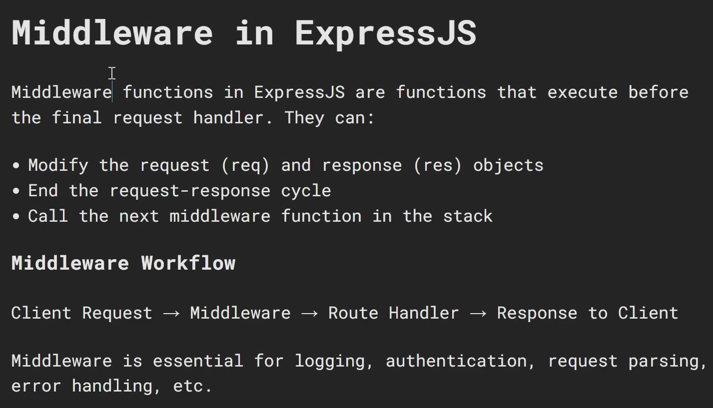
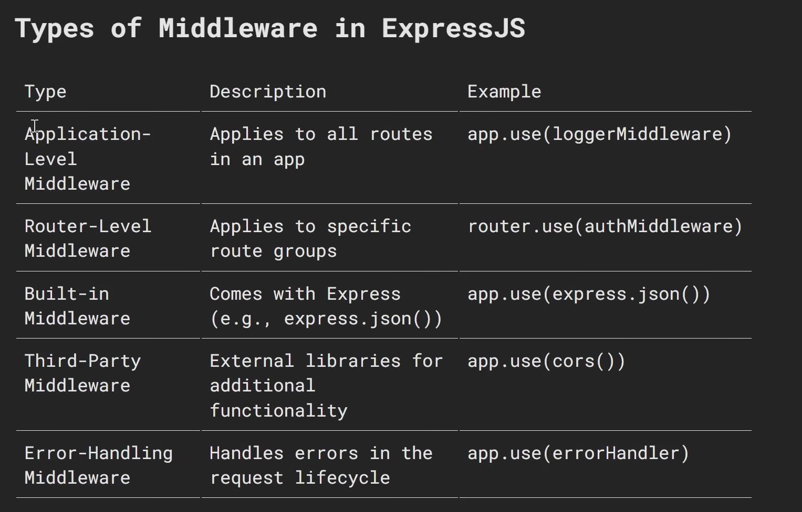

# Middleware in Express.js — A Detailed Guide

---

## Table of Contents

1. [What is Middleware?](#1-what-is-middleware)
2. [How Middleware Works — The Pipeline](#2-how-middleware-works--the-pipeline)
3. [Middleware Function Anatomy](#3-middleware-function-anatomy)
4. [Types of Middleware](#4-types-of-middleware)
5. [Application-Level Middleware](#5-application-level-middleware)
6. [Route-Level Middleware](#6-route-level-middleware)
7. [Router-Level Middleware](#7-router-level-middleware)
8. [Error-Handling Middleware](#8-error-handling-middleware)
9. [Built-in Middleware](#9-built-in-middleware)
10. [Third-Party Middleware](#10-third-party-middleware)
11. [Writing Custom Middleware](#11-writing-custom-middleware)
12. [Chaining Multiple Middleware](#12-chaining-multiple-middleware)
13. [next() — The Key to the Pipeline](#13-next--the-key-to-the-pipeline)
14. [Middleware Execution Order](#14-middleware-execution-order)
15. [Common Real-World Middleware Patterns](#15-common-real-world-middleware-patterns)
16. [Quick Reference Cheatsheet](#16-quick-reference-cheatsheet)

---

## 1. What is Middleware?

**Middleware** is any function that runs **between the incoming request and the outgoing response**. It has access to the request object (`req`), the response object (`res`), and a `next` function that passes control to the next middleware in the chain.

Think of it as a series of checkpoints every request must pass through before reaching its final destination (the route handler).

```
Incoming Request
      │
      ▼
┌─────────────────┐
│  Middleware 1   │  → Log the request
└────────┬────────┘
         │ next()
         ▼
┌─────────────────┐
│  Middleware 2   │  → Parse the JSON body
└────────┬────────┘
         │ next()
         ▼
┌─────────────────┐
│  Middleware 3   │  → Check authentication
└────────┬────────┘
         │ next()
         ▼
┌─────────────────┐
│  Route Handler  │  → Send the final response
└─────────────────┘
         │
         ▼
Outgoing Response
```

### Real-world analogy

Think of an airport security process:

```
Passenger (Request)
      │
      ▼
  Ticket Check       ← Middleware 1 (authentication)
      │
      ▼
  Baggage Scan       ← Middleware 2 (body parsing / validation)
      │
      ▼
  Passport Control   ← Middleware 3 (authorization)
      │
      ▼
  Board the Plane    ← Route Handler (final response)
```

Each step can either pass the passenger forward or stop them entirely.

---

## 2. How Middleware Works — The Pipeline

The middleware pipeline is **linear and ordered**. Express runs middleware in the exact order they are registered with `app.use()` or placed in a route.

```javascript
app.use(middlewareA);   // runs first
app.use(middlewareB);   // runs second
app.use(middlewareC);   // runs third
app.get("/", handler);  // runs last — only if all above called next()
```

### Pipeline can be stopped at any point

A middleware can **stop the chain** by sending a response without calling `next()`. Once a response is sent, no further middleware or route handler runs.

```
Request
  │
  ▼
Middleware A → calls next() → continues ✅
  │
  ▼
Middleware B → sends res.json({ error: "Unauthorized" }) → STOPS ❌
  │
  ✗ (Middleware C and route handler never run)
```

---

## 3. Middleware Function Anatomy

Every middleware function has the same signature:

```javascript
function middlewareName(req, res, next) {
  // req  → the incoming HTTP request object
  //        (read URL, headers, body, params, query, etc.)

  // res  → the outgoing HTTP response object
  //        (send a response to stop the chain)

  // next → a function that passes control to the next middleware
  //        MUST be called if you don't send a response here
  //        next()      → go to next middleware
  //        next(err)   → jump to the error-handling middleware

  // Do something...

  next(); // pass control forward
}
```

### The three possible actions inside middleware

```javascript
function middleware(req, res, next) {

  // Option 1: Pass control to the next middleware (most common)
  next();

  // Option 2: Send a response and STOP the chain
  res.status(401).json({ error: "Unauthorized" });

  // Option 3: Pass an error to the error handler
  next(new Error("Something went wrong"));

}
```

> **Rule:** Every middleware MUST either call `next()` OR send a response.  
> If neither happens — the request will hang forever and the client will time out.

---

## 4. Types of Middleware

Express has five categories of middleware:

```
┌──────────────────────────────────────────────────────────────┐
│  1. Application-level   → app.use() — runs on all routes    │
│  2. Route-level         → passed directly into a route      │
│  3. Router-level        → attached to an express.Router()   │
│  4. Error-handling      → 4 parameters (err, req, res, next)│
│  5. Built-in / Third-party → express.json(), morgan, etc.   │
└──────────────────────────────────────────────────────────────┘
```

---

## 5. Application-Level Middleware

Registered with `app.use()` — runs on **every request** to the application (or every request matching a given path prefix).

### Without a path — runs on ALL routes

```javascript
import express from "express";
const app = express();

// This middleware runs before EVERY route in the entire application
app.use((req, res, next) => {
  console.log(`[${new Date().toISOString()}] ${req.method} ${req.url}`);
  // Example log: [2025-01-15T10:30:00.000Z] GET /users

  next(); // must call next() or the request stops here
});

app.get("/",      (req, res) => res.send("Home"));
app.get("/users", (req, res) => res.send("Users"));
// Both routes are logged because the middleware above has no path filter
```

### With a path — runs only for matching prefixes

```javascript
// Only runs for routes whose URL starts with "/api"
// Matches: /api, /api/users, /api/posts/5, /api/anything
// Skips:   /, /about, /contact
app.use("/api", (req, res, next) => {
  console.log("API route accessed");
  next();
});

// Only runs for routes starting with "/admin"
app.use("/admin", (req, res, next) => {
  const isAdmin = req.headers["x-admin-key"] === "secret";
  if (!isAdmin) {
    return res.status(403).json({ error: "Admin access required" });
  }
  next();
});
```

### Multiple middleware in one app.use()

```javascript
function logger(req, res, next) {
  console.log(`${req.method} ${req.url}`);
  next();
}

function timestamp(req, res, next) {
  req.requestTime = Date.now(); // attach data to req for downstream use
  next();
}

// Both run on every request, in order
app.use(logger, timestamp);
```

---

## 6. Route-Level Middleware

Passed **directly into a specific route** as arguments between the path and the final handler. Runs only when that exact route is matched.

```javascript
// Authentication middleware — checks for a valid token
function isAuthenticated(req, res, next) {
  const token = req.headers["authorization"];

  if (!token) {
    // No token → stop the chain and send 401
    return res.status(401).json({ error: "No token provided" });
  }

  if (token !== "Bearer valid-token") {
    return res.status(401).json({ error: "Invalid token" });
  }

  // Token is valid → attach user info and proceed
  req.user = { id: 1, name: "Alice", role: "admin" };
  next();
}

// Authorization middleware — checks user has the right role
function isAdmin(req, res, next) {
  // req.user was attached by isAuthenticated above
  if (req.user.role !== "admin") {
    return res.status(403).json({ error: "Admin access required" });
  }
  next();
}

// Public route — no middleware
app.get("/public", (req, res) => {
  res.json({ message: "Anyone can see this" });
});

// Protected route — requires valid token
app.get("/profile", isAuthenticated, (req, res) => {
  res.json({ message: `Welcome, ${req.user.name}` });
});

// Admin-only route — requires valid token AND admin role
// Middleware run in order: isAuthenticated → isAdmin → handler
app.delete("/users/:id", isAuthenticated, isAdmin, (req, res) => {
  res.json({ message: `User ${req.params.id} deleted by admin` });
});
```

---

## 7. Router-Level Middleware

Applied to an `express.Router()` instance. Runs only for routes defined on that router — useful for protecting groups of related routes.

```javascript
// routes/adminRoutes.js
import { Router } from "express";

const router = Router();

// This middleware runs for ALL routes defined on this router
// Protects the entire /admin section without touching other routes
router.use((req, res, next) => {
  const adminKey = req.headers["x-admin-key"];

  if (!adminKey || adminKey !== process.env.ADMIN_KEY) {
    return res.status(403).json({ error: "Forbidden — admin key required" });
  }

  console.log(`Admin action: ${req.method} ${req.url}`);
  next();
});

// All routes below are protected by the middleware above
router.get("/dashboard", (req, res) => {
  res.json({ message: "Admin dashboard" });
});

router.get("/users", (req, res) => {
  res.json({ message: "All users (admin view)" });
});

router.delete("/users/:id", (req, res) => {
  res.json({ message: `User ${req.params.id} deleted` });
});

export default router;
```

```javascript
// app.js — mount the router
import adminRoutes from "./routes/adminRoutes.js";

// Every request to /admin/* passes through the router middleware first
app.use("/admin", adminRoutes);

// Resulting protected routes:
//   GET    /admin/dashboard
//   GET    /admin/users
//   DELETE /admin/users/:id
```

---

## 8. Error-Handling Middleware

Error-handling middleware has **exactly 4 parameters**: `(err, req, res, next)`.  
Express identifies it as an error handler because of the 4th parameter.

It only runs when:
- `next(err)` is called with an error argument, OR
- An unhandled synchronous error is thrown inside a route

```javascript
// ── Triggering the error handler ─────────────────────────────

// Method 1: next(err) — pass an error manually
app.get("/boom", (req, res, next) => {
  const err = new Error("Something exploded!");
  err.statusCode = 500;
  next(err); // skips all normal middleware and goes to error handler
});

// Method 2: throw inside a sync route — Express catches it automatically
app.get("/sync-error", (req, res) => {
  throw new Error("Synchronous crash!"); // Express catches this
});

// Method 3: async errors — MUST catch manually and call next(err)
app.get("/async-error", async (req, res, next) => {
  try {
    const data = await someDatabaseCall();
    res.json(data);
  } catch (err) {
    next(err); // Express does NOT auto-catch async errors
  }
});

// ── Custom Error Class ────────────────────────────────────────

class AppError extends Error {
  constructor(message, statusCode) {
    super(message);
    this.statusCode = statusCode;
    this.name = "AppError";
  }
}

app.get("/not-found", (req, res, next) => {
  next(new AppError("Resource not found", 404));
});

// ── Error Handler ─────────────────────────────────────────────
// MUST be registered AFTER all routes and middleware
// MUST have exactly 4 parameters — do not omit 'next' even if unused

app.use((err, req, res, next) => {
  // Log the full stack trace on the server side
  console.error(`[ERROR] ${err.name}: ${err.message}`);
  console.error(err.stack);

  const statusCode = err.statusCode || 500;
  const message    = err.message    || "Internal Server Error";

  res.status(statusCode).json({
    error: message,
    // Only expose stack trace in development — never in production
    ...(process.env.NODE_ENV === "development" && { stack: err.stack }),
  });
});
```

### Multiple error handlers

```javascript
// You can have multiple error handlers for different error types
// They are chained just like normal middleware — call next(err) to pass forward

// Handle only validation errors
app.use((err, req, res, next) => {
  if (err.name === "ValidationError") {
    return res.status(422).json({ error: err.message });
  }
  next(err); // not a validation error — pass to the next error handler
});

// Handle JWT authentication errors
app.use((err, req, res, next) => {
  if (err.name === "JsonWebTokenError") {
    return res.status(401).json({ error: "Invalid token" });
  }
  next(err);
});

// Catch-all error handler — handles everything else
app.use((err, req, res, next) => {
  res.status(500).json({ error: "Internal Server Error" });
});
```

---

## 9. Built-in Middleware

Express ships with three built-in middleware functions:

### express.json()

Parses incoming requests with a **JSON body**.  
Sets `Content-Type: application/json` as the requirement.

```javascript
app.use(express.json());

// POST /users
// Content-Type: application/json
// Body: {"name": "Alice", "email": "alice@example.com"}
app.post("/users", (req, res) => {
  console.log(req.body); // → { name: "Alice", email: "alice@example.com" }
  res.status(201).json(req.body);
});

// With options — limit body size to prevent large payload attacks
app.use(express.json({ limit: "10kb" }));
```

### express.urlencoded()

Parses incoming requests with **URL-encoded bodies** (HTML form submissions).  
Sets `Content-Type: application/x-www-form-urlencoded` as the requirement.

```javascript
app.use(express.urlencoded({ extended: true }));
// extended: true  → uses the 'qs' library — supports nested objects
// extended: false → uses the 'querystring' library — flat key-value only

// HTML form POST
// <form method="POST" action="/login">
//   <input name="username" value="alice" />
//   <input name="password" value="secret" />
// </form>
app.post("/login", (req, res) => {
  console.log(req.body); // → { username: "alice", password: "secret" }
  res.send(`Logged in as ${req.body.username}`);
});
```

### express.static()

Serves **static files** (HTML, CSS, JS, images, fonts) from a directory.

```javascript
import path from "path";
import { fileURLToPath } from "url";

const __dirname = path.dirname(fileURLToPath(import.meta.url));

// Serve all files inside the "public" folder
app.use(express.static(path.join(__dirname, "public")));

// public/index.html  → http://localhost:3000/
// public/style.css   → http://localhost:3000/style.css
// public/logo.png    → http://localhost:3000/logo.png

// With a virtual path prefix
app.use("/static", express.static("public"));
// public/logo.png    → http://localhost:3000/static/logo.png

// With caching options
app.use(express.static("public", {
  maxAge: "1d",    // cache files for 1 day
  etag:   false,   // disable ETags
}));
```

---

## 10. Third-Party Middleware

### morgan — HTTP Request Logger

```bash
npm install morgan
```

```javascript
import morgan from "morgan";

// "dev" format: GET /users 200 5.123 ms - 48
app.use(morgan("dev"));

// Other formats:
// "tiny"     → minimal output
// "short"    → shorter than "combined"
// "combined" → Apache standard log format (best for production)
// "common"   → Apache common log format

// Custom format
app.use(morgan(":method :url :status :response-time ms — :res[content-length] bytes"));

// Log only errors (status >= 400)
app.use(morgan("dev", {
  skip: (req, res) => res.statusCode < 400,
}));
```

### cors — Cross-Origin Resource Sharing

```bash
npm install cors
```

```javascript
import cors from "cors";

// Allow ALL origins — fine for development, risky for production
app.use(cors());

// Allow only specific origin
app.use(cors({
  origin:      "https://yourfrontend.com",
  methods:     ["GET", "POST", "PUT", "DELETE"],
  allowedHeaders: ["Content-Type", "Authorization"],
  credentials: true,   // allow cookies to be sent cross-origin
}));

// Allow multiple origins dynamically
const allowedOrigins = ["https://app.com", "https://admin.app.com"];
app.use(cors({
  origin: (origin, callback) => {
    if (!origin || allowedOrigins.includes(origin)) {
      callback(null, true);
    } else {
      callback(new Error("Not allowed by CORS"));
    }
  },
}));
```

### helmet — Security Headers

```bash
npm install helmet
```

```javascript
import helmet from "helmet";

// Sets 11 security-related HTTP headers automatically:
//   Content-Security-Policy
//   X-DNS-Prefetch-Control
//   X-Frame-Options         → prevents clickjacking
//   X-Powered-By            → hides "Express" from responses
//   Strict-Transport-Security → enforces HTTPS
//   X-Content-Type-Options  → prevents MIME sniffing
//   ... and more
app.use(helmet());

// Customize individual protections
app.use(helmet({
  contentSecurityPolicy: false,  // disable CSP if it breaks your app
  frameguard: { action: "deny" },
}));
```

### express-rate-limit — Rate Limiting

```bash
npm install express-rate-limit
```

```javascript
import rateLimit from "express-rate-limit";

// Limit all API routes: max 100 requests per 15 minutes per IP
const apiLimiter = rateLimit({
  windowMs: 15 * 60 * 1000,  // 15 minutes in milliseconds
  max:      100,               // max requests per window
  message:  { error: "Too many requests — please try again in 15 minutes" },
  standardHeaders: true,       // sends RateLimit-* headers
  legacyHeaders:   false,
});

app.use("/api", apiLimiter);

// Stricter limit for login route — prevent brute-force attacks
const loginLimiter = rateLimit({
  windowMs: 15 * 60 * 1000,
  max:      10,
  message:  { error: "Too many login attempts — try again later" },
});

app.post("/api/auth/login", loginLimiter, (req, res) => {
  res.json({ message: "Login attempt" });
});
```

### cookie-parser — Parse Cookies

```bash
npm install cookie-parser
```

```javascript
import cookieParser from "cookie-parser";

app.use(cookieParser());

// Set a cookie
app.get("/set-cookie", (req, res) => {
  res.cookie("sessionId", "abc123", {
    httpOnly: true,   // not accessible via JavaScript (prevents XSS)
    secure:   true,   // only sent over HTTPS
    maxAge:   86400000, // expires in 1 day (milliseconds)
    sameSite: "strict", // prevent CSRF attacks
  });
  res.send("Cookie set!");
});

// Read a cookie
app.get("/get-cookie", (req, res) => {
  const sessionId = req.cookies.sessionId;
  res.json({ sessionId });
});

// Clear a cookie
app.get("/clear-cookie", (req, res) => {
  res.clearCookie("sessionId");
  res.send("Cookie cleared!");
});
```

---

## 11. Writing Custom Middleware

### Request Logger

```javascript
// Logs method, URL, status code, and response time for every request
function requestLogger(req, res, next) {
  const start = Date.now(); // record when the request arrived

  // res.on("finish") fires AFTER the response is sent
  // This is the only way to log the status code — it's not set until then
  res.on("finish", () => {
    const duration = Date.now() - start;
    console.log(
      `[${new Date().toISOString()}] ${req.method} ${req.url} — ${res.statusCode} (${duration}ms)`
    );
  });

  next(); // must call next — logger doesn't send a response
}

app.use(requestLogger);
```

### Request ID Middleware

```javascript
import crypto from "crypto";

// Attaches a unique ID to every request — useful for tracing logs
function attachRequestId(req, res, next) {
  req.id = crypto.randomUUID();     // generate a unique ID
  res.set("X-Request-Id", req.id);  // send it back in the response header
  next();
}

app.use(attachRequestId);

app.get("/", (req, res) => {
  console.log(`Handling request ${req.id}`);
  res.json({ requestId: req.id });
});
```

### Input Validation Middleware

```javascript
// Validates that required fields are present in the request body
// Reusable — can be applied to any route that needs validation
function validateUserBody(req, res, next) {
  const { name, email } = req.body;
  const errors = [];

  if (!name  || name.trim() === "")  errors.push("'name' is required");
  if (!email || email.trim() === "") errors.push("'email' is required");

  // Basic email format check
  const emailRegex = /^[^\s@]+@[^\s@]+\.[^\s@]+$/;
  if (email && !emailRegex.test(email)) errors.push("'email' must be a valid email address");

  if (errors.length > 0) {
    // Validation failed — stop the chain and send 400
    return res.status(400).json({ errors });
  }

  next(); // validation passed — proceed to the route handler
}

// Apply only to routes that need it
app.post("/users", validateUserBody, (req, res) => {
  res.status(201).json({ message: "User created", data: req.body });
});

app.put("/users/:id", validateUserBody, (req, res) => {
  res.json({ message: `User ${req.params.id} updated`, data: req.body });
});
```

### Authentication Middleware (JWT)

```javascript
import jwt from "jsonwebtoken"; // npm install jsonwebtoken

function authenticate(req, res, next) {
  // Authorization header format: "Bearer <token>"
  const authHeader = req.headers["authorization"];

  if (!authHeader || !authHeader.startsWith("Bearer ")) {
    return res.status(401).json({ error: "Authorization header missing or malformed" });
  }

  const token = authHeader.split(" ")[1]; // extract the token part

  try {
    // Verify the token using your secret key
    // If invalid or expired, jwt.verify() throws an error
    const decoded = jwt.verify(token, process.env.JWT_SECRET);

    req.user = decoded; // attach decoded payload to req for downstream use
    next();             // token valid — proceed
  } catch (err) {
    return res.status(401).json({ error: "Invalid or expired token" });
  }
}

// Public — no auth required
app.post("/auth/login", (req, res) => {
  const token = jwt.sign({ id: 1, name: "Alice" }, process.env.JWT_SECRET, {
    expiresIn: "1h",
  });
  res.json({ token });
});

// Protected — requires a valid JWT
app.get("/profile", authenticate, (req, res) => {
  res.json({ message: `Hello, ${req.user.name}` });
});
```

---

## 12. Chaining Multiple Middleware

Multiple middleware functions can be chained in three ways:

### As separate app.use() calls

```javascript
app.use(express.json());
app.use(morgan("dev"));
app.use(helmet());
app.use(cors());
// All four run on every request, in this exact order
```

### As multiple arguments in app.use()

```javascript
// Equivalent to the four separate calls above
app.use(express.json(), morgan("dev"), helmet(), cors());
```

### As multiple arguments in a route

```javascript
// Three middleware run in order before the final handler
app.post(
  "/users",
  authenticate,       // Step 1: check token
  isAdmin,            // Step 2: check role
  validateUserBody,   // Step 3: validate input
  (req, res) => {     // Step 4: handle the request
    res.status(201).json({ message: "User created" });
  }
);
```

### As an array

```javascript
// Grouping related middleware in an array — useful for reuse
const authStack  = [authenticate, isAdmin];
const userStack  = [authenticate, validateUserBody];

app.get("/admin/users", authStack,  getAllUsers);
app.post("/users",      userStack,  createUser);
app.put("/users/:id",   userStack,  updateUser);
```

---

## 13. next() — The Key to the Pipeline

`next()` is the function that moves the request forward in the middleware chain. Understanding it fully is essential.

```javascript
// next()         → move to the next middleware or route handler
// next("route")  → skip remaining middleware in this route, jump to next route
// next(err)      → skip all normal middleware, jump to error handler

// ── next() — normal flow ─────────────────────────────────────
app.use((req, res, next) => {
  console.log("Middleware 1");
  next(); // goes to Middleware 2
});

app.use((req, res, next) => {
  console.log("Middleware 2");
  next(); // goes to the route handler
});

app.get("/", (req, res) => {
  res.send("Route handler reached");
});
// Output: Middleware 1 → Middleware 2 → Route handler reached

// ── next("route") — skip to next route ───────────────────────
app.get("/users",
  (req, res, next) => {
    if (req.query.special === "true") {
      return next("route"); // skip the rest — jump to the next /users handler
    }
    res.json({ message: "Normal users" });
  },
  (req, res) => {
    // This runs only if next("route") was NOT called
    res.json({ message: "This is skipped for special=true" });
  }
);

app.get("/users", (req, res) => {
  // This runs when next("route") WAS called
  res.json({ message: "Special users endpoint" });
});

// ── next(err) — trigger error handler ────────────────────────
app.get("/fail", (req, res, next) => {
  try {
    throw new Error("Database connection failed");
  } catch (err) {
    next(err); // jump directly to the error-handling middleware
  }
});

// ── Forgetting to call next() — the silent bug ────────────────
app.use((req, res, next) => {
  console.log("This runs...");
  // ❌ next() NOT called — request hangs here forever
  // The client will eventually time out
});
```

---

## 14. Middleware Execution Order

Order matters enormously in Express. Here is the correct order for a production app:

```javascript
import express from "express";
import morgan  from "morgan";
import helmet  from "helmet";
import cors    from "cors";

const app = express();

// ── 1. Security headers — first, before anything else ────────
app.use(helmet());

// ── 2. CORS — before body parsers so preflight OPTIONS works ─
app.use(cors());

// ── 3. Request logging — after security, before routes ───────
app.use(morgan("dev"));

// ── 4. Body parsers — before any route reads req.body ────────
app.use(express.json());
app.use(express.urlencoded({ extended: true }));

// ── 5. Custom application-level middleware ────────────────────
app.use(attachRequestId);  // attach unique ID to every request

// ── 6. Static files — before API routes ──────────────────────
app.use(express.static("public"));

// ── 7. Routes ─────────────────────────────────────────────────
app.use("/api/users", usersRouter);
app.use("/api/posts", postsRouter);

// ── 8. 404 handler — after ALL routes ────────────────────────
app.use((req, res) => {
  res.status(404).json({ error: "Route not found" });
});

// ── 9. Error handler — LAST, always ──────────────────────────
app.use((err, req, res, next) => {
  res.status(err.statusCode || 500).json({ error: err.message });
});
```

---

## 15. Common Real-World Middleware Patterns

### Pattern 1 — Protect an entire router

```javascript
// All routes under /api/admin require authentication AND admin role
import { Router } from "express";
const adminRouter = Router();

adminRouter.use(authenticate); // applies to all routes on this router
adminRouter.use(isAdmin);

adminRouter.get("/stats",    getStats);
adminRouter.get("/users",    getAllUsers);
adminRouter.delete("/users/:id", deleteUser);

app.use("/api/admin", adminRouter);
```

### Pattern 2 — Attach data to req for downstream use

```javascript
// Middleware fetches the user from DB and attaches to req
// Every downstream middleware and handler can access req.user
async function loadUser(req, res, next) {
  try {
    const user = await User.findById(req.params.id);
    if (!user) return res.status(404).json({ error: "User not found" });
    req.user = user; // attach for downstream
    next();
  } catch (err) {
    next(err);
  }
}

app.get("/users/:id",        loadUser, getUser);
app.put("/users/:id",        loadUser, updateUser);
app.delete("/users/:id",     loadUser, isAdmin, deleteUser);
// All three routes share the same "load user" logic — no repetition
```

### Pattern 3 — Conditional middleware

```javascript
// Apply rate limiting only in production
if (process.env.NODE_ENV === "production") {
  app.use("/api", rateLimiter);
}

// Apply morgan only when not testing
if (process.env.NODE_ENV !== "test") {
  app.use(morgan("dev"));
}
```

### Pattern 4 — Middleware factory (configurable middleware)

```javascript
// A function that RETURNS a middleware — accepts config options
function requireRole(role) {
  return function (req, res, next) {
    if (!req.user) {
      return res.status(401).json({ error: "Not authenticated" });
    }
    if (req.user.role !== role) {
      return res.status(403).json({ error: `Requires ${role} role` });
    }
    next();
  };
}

// Use the factory to create role-specific middleware
app.get("/admin", authenticate, requireRole("admin"), adminHandler);
app.get("/editor", authenticate, requireRole("editor"), editorHandler);
app.get("/viewer", authenticate, requireRole("viewer"), viewerHandler);
```

---

## 16. Quick Reference Cheatsheet

```
┌─────────────────────────────────────────────────────────────────┐
│                    MIDDLEWARE TYPES                             │
├────────────────────────┬────────────────────────────────────────┤
│ Application-level      │ app.use() — runs on all routes        │
│ Route-level            │ passed into a specific route          │
│ Router-level           │ router.use() — on a Router instance   │
│ Error-handling         │ (err, req, res, next) — 4 params      │
│ Built-in               │ express.json/urlencoded/static        │
│ Third-party            │ morgan, cors, helmet, rate-limit...   │
└────────────────────────┴────────────────────────────────────────┘

┌─────────────────────────────────────────────────────────────────┐
│                      next() VARIANTS                            │
├────────────────────────┬────────────────────────────────────────┤
│ next()                 │ Go to next middleware / handler        │
│ next("route")          │ Skip to next matching route           │
│ next(err)              │ Jump to error-handling middleware      │
│ (nothing called)       │ ❌ Request hangs — client times out    │
└────────────────────────┴────────────────────────────────────────┘

┌─────────────────────────────────────────────────────────────────┐
│               CORRECT REGISTRATION ORDER                        │
├─────────────────────────────────────────────────────────────────┤
│  1. helmet()           Security headers                         │
│  2. cors()             Cross-origin policy                      │
│  3. morgan()           Request logging                          │
│  4. express.json()     Body parsing                             │
│  5. express.static()   Static files                             │
│  6. Custom middleware  Auth, logging, rate limit                │
│  7. Routes             app.use("/api/...", router)              │
│  8. 404 handler        After all routes                         │
│  9. Error handler      Last — (err, req, res, next)            │
└─────────────────────────────────────────────────────────────────┘

┌─────────────────────────────────────────────────────────────────┐
│                  COMMON MISTAKES                                │
├─────────────────────────────────────────────────────────────────┤
│ ❌ Forgetting next()      → request hangs forever               │
│ ❌ Calling next() after   → "headers already sent" crash        │
│    res.json()                                                   │
│ ❌ Putting error handler  → errors not caught                   │
│    before routes                                                │
│ ❌ Using express.json()   → req.body is undefined               │
│    after route reads body                                       │
│ ❌ Not catching async     → unhandled promise rejection         │
│    errors with next(err)                                        │
└─────────────────────────────────────────────────────────────────┘
```

---

> **Summary:** Middleware is the backbone of every Express application. It keeps your code modular, reusable, and clean by separating concerns — logging, parsing, authentication, validation, and error handling each live in their own focused functions. Master the pipeline, always call `next()` or send a response, and register middleware in the right order — everything else follows naturally.
