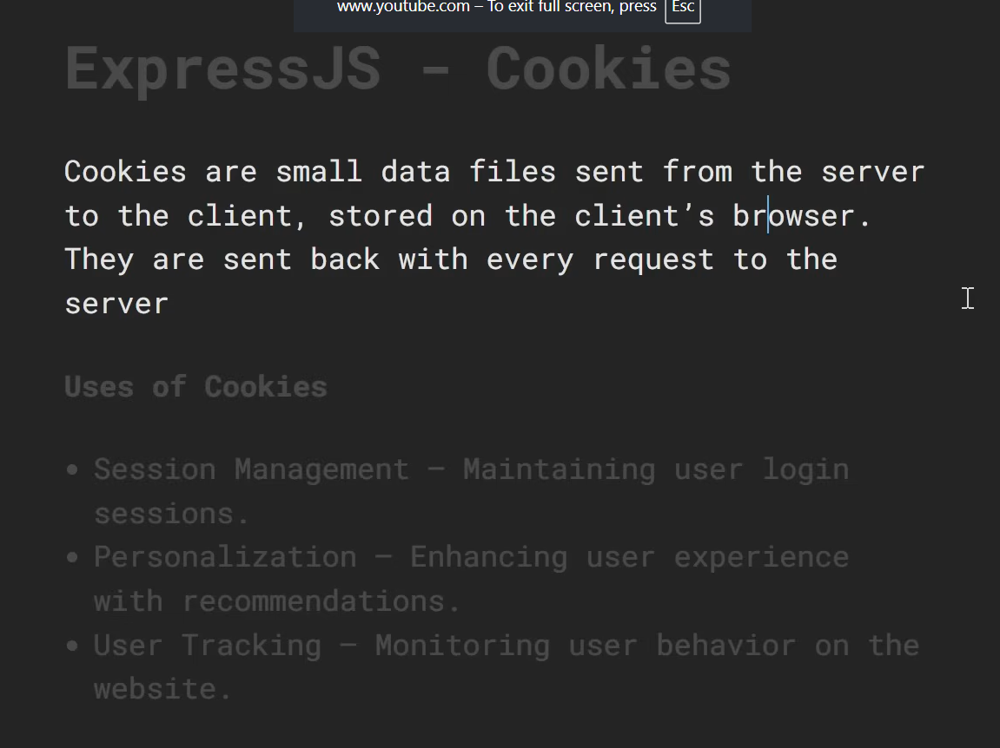

## Working with Cookies
 
Cookies are small pieces of data stored on the client's browser. Express.js provides easy ways to read, set, and delete cookies.
 
 
 
### 1.1 Installing cookie-parser
 
```bash
npm install cookie-parser
```
 
### 1.2 Setting Up cookie-parser Middleware
 
```js
const express = require('express');
const cookieParser = require('cookie-parser');
 
const app = express();
 
// Mount cookie-parser middleware
app.use(cookieParser());
 
app.listen(3000, () => console.log('Server running on port 3000'));
```
 
### 1.3 Setting a Cookie
 
Use `res.cookie(name, value, options)` to send a cookie to the client.
 
```js
app.get('/set-cookie', (req, res) => {
  res.cookie('username', 'JohnDoe', {
    maxAge: 24 * 60 * 60 * 1000, // 1 day in milliseconds
    httpOnly: true,               // Inaccessible to client-side JS
    secure: true,                 // Sent only over HTTPS
    sameSite: 'Strict',           // Prevents CSRF
  });
 
  res.send('Cookie has been set!');
});
```
 
### 1.4 Cookie Options Reference
 
| Option       | Type      | Description                                                       |
|--------------|-----------|-------------------------------------------------------------------|
| `maxAge`     | `number`  | Expiry time in milliseconds from now                              |
| `expires`    | `Date`    | Exact expiry date                                                 |
| `httpOnly`   | `boolean` | Prevents access via `document.cookie` (XSS protection)           |
| `secure`     | `boolean` | Cookie sent only over HTTPS                                       |
| `sameSite`   | `string`  | `'Strict'`, `'Lax'`, or `'None'` — controls cross-site behavior  |
| `domain`     | `string`  | Specifies the domain the cookie belongs to                        |
| `path`       | `string`  | URL path the cookie is valid for (default: `/`)                   |
| `signed`     | `boolean` | Whether the cookie should be signed                               |
 
### 1.5 Reading Cookies
 
```js
app.get('/get-cookie', (req, res) => {
  const username = req.cookies.username;
 
  if (username) {
    res.send(`Hello, ${username}!`);
  } else {
    res.send('No cookie found.');
  }
});
```
 
### 1.6 Signed Cookies
 
Signed cookies are tamper-proof — they are hashed with a secret key.
 
```js
// Pass a secret to cookie-parser
app.use(cookieParser('mySecretKey'));
 
// Set a signed cookie
app.get('/set-signed', (req, res) => {
  res.cookie('token', 'abc123', { signed: true });
  res.send('Signed cookie set!');
});
 
// Read a signed cookie
app.get('/get-signed', (req, res) => {
  const token = req.signedCookies.token;
  res.send(token ? `Token: ${token}` : 'Invalid or missing cookie');
});
```
 
### 1.7 Deleting a Cookie
 
```js
app.get('/clear-cookie', (req, res) => {
  res.clearCookie('username');
  res.send('Cookie cleared!');
});
```
 
### 1.8 Cookie Security Best Practices
 
- Always use `httpOnly: true` to mitigate XSS attacks.
- Use `secure: true` in production (requires HTTPS).
- Set a short `maxAge` for sensitive cookies.
- Use `signed: true` for cookies that carry sensitive identifiers.
- Set `sameSite: 'Strict'` or `'Lax'` to reduce CSRF risk.
---