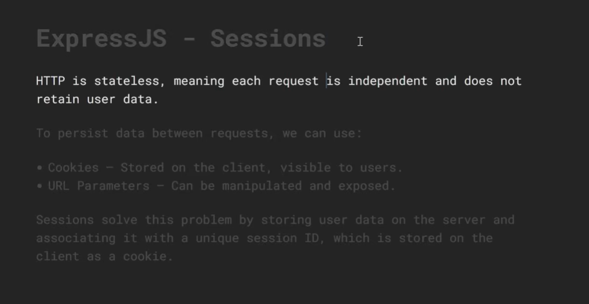

 
 # Session Management in Express.js

Session management allows your server to **remember state between requests**. Since HTTP is stateless (each request is independent), sessions give you a way to identify and track users across multiple requests.

---

## What is a Session?

```
HTTP is stateless:
  Request 1 → Server has no idea who you are
  Request 2 → Server still has no idea who you are

With Sessions:
  Request 1 → Login → Server creates session → gives you a session ID
  Request 2 → Send session ID → Server recognizes you ✅
  Request 3 → Send session ID → Server still knows you ✅
```

```
Flow:
┌────────┐         ┌────────────┐         ┌──────────────┐
│ Client │         │  Express   │         │ Session Store│
│        │──login─►│            │──save──►│  (memory /   │
│        │◄─cookie─│ create     │         │   Redis /    │
│        │         │ session    │         │   MongoDB)   │
│        │──req────►│            │──find──►│              │
│        │◄─data───│ read sess  │◄─return─│              │
└────────┘         └────────────┘         └──────────────┘
```

---

## Cookies vs Sessions vs JWT

```
Cookies:
  → Small data stored in the BROWSER
  → Sent automatically with every request
  → Can store session ID or data directly

Sessions:
  → Data stored on the SERVER
  → Browser only stores a session ID (in a cookie)
  → More secure — sensitive data never leaves server

JWT (JSON Web Token):
  → Token stored in browser (localStorage or cookie)
  → Data encoded IN the token (stateless)
  → Server doesn't store anything

Which to use:
  Sessions → traditional web apps, e-commerce, banking
  JWT      → REST APIs, mobile apps, microservices
```

---

## Setup — Install Required Packages

```bash
npm install express express-session
npm install connect-mongo        # MongoDB session store
npm install connect-redis        # Redis session store
npm install -D nodemon
```

---

## Part 1 — Basic Session Setup

```js
// app.js
import express        from 'express';
import session        from 'express-session';

const app = express();
app.use(express.json());
app.use(express.urlencoded({ extended: true }));

// ── Session Middleware ─────────────────────────────────────
app.use(session({
  secret:            'my-super-secret-key', // used to sign the session ID cookie
  resave:            false,  // don't save session if nothing changed
  saveUninitialized: false,  // don't create session until data is stored
  cookie: {
    secure:   false,         // true in production (requires HTTPS)
    httpOnly: true,          // prevents JS from accessing cookie (XSS protection)
    maxAge:   1000 * 60 * 60 * 24, // 24 hours in milliseconds
  }
}));

// ── Routes ────────────────────────────────────────────────
app.get('/', (req, res) => {
  res.json({ message: 'Home route' });
});

app.listen(3000, () => console.log('Server on http://localhost:3000'));
```

---

## Part 2 — Session Options Explained

```js
app.use(session({
  // ── Required ─────────────────────────────────────
  secret: 'your-secret-key',
  // Used to sign + verify the session ID cookie
  // In production: use a long random string from environment variable
  // secret: process.env.SESSION_SECRET

  // ── Behavior ─────────────────────────────────────
  resave: false,
  // false → only save session if it was modified (recommended)
  // true  → save session on every request even if unchanged

  saveUninitialized: false,
  // false → don't create session until something is stored (recommended)
  // true  → create session for every visitor even if not logged in

  name: 'sessionId',
  // Name of the cookie sent to the browser
  // Default: 'connect.sid'
  // Change it so attackers can't identify your session library

  // ── Cookie Settings ───────────────────────────────
  cookie: {
    secure:   process.env.NODE_ENV === 'production',
    // true  → cookie only sent over HTTPS (required in production)
    // false → works over HTTP (development only)

    httpOnly: true,
    // true  → cookie cannot be accessed by JavaScript (blocks XSS attacks)
    // false → JavaScript can read the cookie (dangerous)

    maxAge: 1000 * 60 * 60 * 24,
    // Cookie expiry in milliseconds
    // 1000ms * 60 * 60 * 24 = 24 hours

    sameSite: 'lax',
    // 'strict' → only sent for same-site requests (most secure)
    // 'lax'    → sent for same-site + top-level navigation (recommended)
    // 'none'   → sent for all requests (requires secure: true)

    domain: 'example.com',
    // Optional: restrict cookie to a specific domain

    path: '/',
    // Cookie is accessible on all paths (default)
  },

  // ── Session Store ─────────────────────────────────
  // store: (see Part 4 for store options)
  // Default: MemoryStore (only for development!)
}));
```

---

## Part 3 — Using Sessions

### Login — Create a Session

```js
// POST /login
app.post('/login', (req, res) => {
  const { username, password } = req.body;

  // Simulate user lookup (use real DB in production)
  const user = { id: 1, username: 'arjun', password: 'password123' };

  if (username !== user.username || password !== user.password) {
    return res.status(401).json({ error: 'Invalid credentials' });
  }

  // Store user data in the session
  req.session.user = {
    id:       user.id,
    username: user.username,
  };
  req.session.isLoggedIn = true;
  req.session.loginTime  = new Date().toISOString();

  res.status(200).json({
    message: 'Login successful',
    user:    req.session.user,
  });
});
```

### Read Session Data

```js
// GET /profile — read session data
app.get('/profile', (req, res) => {
  // Check if session exists and user is logged in
  if (!req.session.user) {
    return res.status(401).json({ error: 'Not logged in' });
  }

  res.status(200).json({
    message:   'Profile data',
    user:      req.session.user,
    loginTime: req.session.loginTime,
    sessionId: req.sessionID, // unique session identifier
  });
});
```

### Update Session Data

```js
// PATCH /profile — update session data
app.patch('/profile', (req, res) => {
  if (!req.session.user) {
    return res.status(401).json({ error: 'Not logged in' });
  }

  // Update data in session
  req.session.user.username = req.body.username || req.session.user.username;
  req.session.lastUpdated   = new Date().toISOString();

  res.status(200).json({
    message: 'Session updated',
    user:    req.session.user,
  });
});
```

### Logout — Destroy a Session

```js
// POST /logout — destroy the session
app.post('/logout', (req, res) => {
  if (!req.session.user) {
    return res.status(400).json({ error: 'Not logged in' });
  }

  // Destroy the session completely
  req.session.destroy((err) => {
    if (err) {
      return res.status(500).json({ error: 'Logout failed' });
    }

    // Clear the session cookie from the browser
    res.clearCookie('connect.sid'); // use your cookie name

    res.status(200).json({ message: 'Logged out successfully' });
  });
});
```

---

## Part 4 — Session Stores

### Default — MemoryStore (Development Only)

```js
// Default store — NO configuration needed
// ⚠️ NOT for production:
//   → Leaks memory over time
//   → Lost when server restarts
//   → Doesn't work with multiple servers

app.use(session({
  secret:            'secret',
  resave:            false,
  saveUninitialized: false,
}));
// Uses MemoryStore automatically
```

---

### MongoDB Store — `connect-mongo`

```bash
npm install connect-mongo mongoose
```

```js
import session    from 'express-session';
import MongoStore from 'connect-mongo';
import mongoose   from 'mongoose';

// Connect to MongoDB
await mongoose.connect('mongodb://localhost:27017/myapp');

app.use(session({
  secret:            process.env.SESSION_SECRET,
  resave:            false,
  saveUninitialized: false,
  store: MongoStore.create({
    mongoUrl:        'mongodb://localhost:27017/myapp',
    collectionName:  'sessions',    // collection to store sessions
    ttl:             60 * 60 * 24,  // session TTL in seconds (24 hours)
    autoRemove:      'native',      // auto-delete expired sessions
  }),
  cookie: {
    maxAge: 1000 * 60 * 60 * 24,   // 24 hours
    httpOnly: true,
    secure:   process.env.NODE_ENV === 'production',
  },
}));
```

---

### Redis Store — `connect-redis`

```bash
npm install connect-redis redis
```

```js
import session     from 'express-session';
import RedisStore  from 'connect-redis';
import { createClient } from 'redis';

// Create Redis client
const redisClient = createClient({
  host: 'localhost',
  port: 6379,
});
await redisClient.connect();

app.use(session({
  secret:            process.env.SESSION_SECRET,
  resave:            false,
  saveUninitialized: false,
  store: new RedisStore({
    client: redisClient,
    prefix: 'myapp:session:',  // key prefix in Redis
    ttl:    86400,              // session TTL in seconds (24 hours)
  }),
  cookie: {
    maxAge:   1000 * 60 * 60 * 24,
    httpOnly: true,
    secure:   process.env.NODE_ENV === 'production',
  },
}));
```

---

### Store Comparison

| Store | Use case | Persists? | Scalable? |
|---|---|---|---|
| `MemoryStore` | Development only | ❌ No | ❌ No |
| `connect-mongo` | Production, MongoDB apps | ✅ Yes | ✅ Yes |
| `connect-redis` | Production, high performance | ✅ Yes | ✅ Yes |
| `connect-pg-simple` | Production, PostgreSQL apps | ✅ Yes | ✅ Yes |

---

## Part 5 — Auth Middleware

Protect routes using session middleware:

```js
// middleware/auth.js

// Check if user is logged in
export function isAuthenticated(req, res, next) {
  if (req.session && req.session.user) {
    return next(); // user is logged in — proceed
  }
  res.status(401).json({ error: 'Unauthorized — please log in' });
}

// Check if user has a specific role
export function isAdmin(req, res, next) {
  if (req.session && req.session.user && req.session.user.role === 'admin') {
    return next();
  }
  res.status(403).json({ error: 'Forbidden — admin access required' });
}

// Redirect if already logged in (for login/register pages)
export function isGuest(req, res, next) {
  if (req.session && req.session.user) {
    return res.status(400).json({ error: 'Already logged in' });
  }
  next();
}
```

```js
// routes/user.js
import { isAuthenticated, isAdmin, isGuest } from '../middleware/auth.js';

// Public route — anyone can access
app.get('/public', (req, res) => {
  res.json({ message: 'Public data' });
});

// Protected route — must be logged in
app.get('/dashboard', isAuthenticated, (req, res) => {
  res.json({ message: `Welcome, ${req.session.user.username}!` });
});

// Admin only
app.get('/admin', isAuthenticated, isAdmin, (req, res) => {
  res.json({ message: 'Admin panel' });
});

// Guest only — redirect if logged in
app.post('/login', isGuest, (req, res) => {
  // login logic
});
```

---

## Part 6 — Session Regeneration (Security)

Regenerate the session ID after login to prevent **session fixation attacks**:

```js
app.post('/login', (req, res) => {
  const { username, password } = req.body;

  // Authenticate user...
  const user = { id: 1, username: 'arjun', role: 'user' };

  // ✅ Regenerate session ID after login (prevents session fixation)
  req.session.regenerate((err) => {
    if (err) {
      return res.status(500).json({ error: 'Session error' });
    }

    // Set session data after regeneration
    req.session.user      = { id: user.id, username: user.username, role: user.role };
    req.session.loginTime = new Date().toISOString();

    res.status(200).json({
      message: 'Login successful',
      user:    req.session.user,
    });
  });
});
```

---

## Part 7 — Session Methods

```js
// req.session properties and methods

req.session                         // the session object
req.session.id                      // session ID (same as req.sessionID)
req.sessionID                       // unique session identifier string

req.session.user = { ... }          // set session data
req.session.myKey                   // read session data
delete req.session.myKey            // delete one key

req.session.save((err) => { })      // manually save session
req.session.reload((err) => { })    // reload session from store
req.session.touch()                 // reset the session expiry

req.session.destroy((err) => { })   // destroy session completely

req.session.cookie.maxAge           // remaining time in ms
req.session.cookie.expires          // expiry date
```

---

## Part 8 — Shopping Cart Example (Real World)

```js
import express from 'express';
import session from 'express-session';

const app = express();
app.use(express.json());

app.use(session({
  secret:            'cart-secret-key',
  resave:            false,
  saveUninitialized: false,
  cookie: { maxAge: 1000 * 60 * 60 }, // 1 hour
}));

// GET /cart — view cart
app.get('/cart', (req, res) => {
  const cart = req.session.cart || [];
  const total = cart.reduce((sum, item) => sum + item.price * item.qty, 0);
  res.json({ cart, total });
});

// POST /cart — add item to cart
app.post('/cart', (req, res) => {
  const { id, name, price, qty } = req.body;

  // Initialize cart if it doesn't exist
  if (!req.session.cart) req.session.cart = [];

  // Check if item already in cart
  const existing = req.session.cart.find(item => item.id === id);

  if (existing) {
    existing.qty += qty; // increase quantity
  } else {
    req.session.cart.push({ id, name, price, qty });
  }

  res.status(201).json({
    message: `${name} added to cart`,
    cart:    req.session.cart,
  });
});

// DELETE /cart/:id — remove item from cart
app.delete('/cart/:id', (req, res) => {
  if (!req.session.cart) {
    return res.status(400).json({ error: 'Cart is empty' });
  }

  req.session.cart = req.session.cart.filter(
    item => item.id !== parseInt(req.params.id)
  );

  res.json({ message: 'Item removed', cart: req.session.cart });
});

// DELETE /cart — clear entire cart
app.delete('/cart', (req, res) => {
  req.session.cart = [];
  res.json({ message: 'Cart cleared' });
});

app.listen(3000, () => console.log('Server on http://localhost:3000'));
```

**Test:**
```bash
# Add items
curl -X POST http://localhost:3000/cart \
  -H "Content-Type: application/json" \
  -d '{"id": 1, "name": "Laptop", "price": 999, "qty": 1}'

# View cart
curl http://localhost:3000/cart

# Remove item
curl -X DELETE http://localhost:3000/cart/1
```

---

## Part 9 — Security Best Practices

```js
app.use(session({
  secret:            process.env.SESSION_SECRET, // ✅ use env variable
  resave:            false,
  saveUninitialized: false,
  name:              '__Host-session',            // ✅ rename from default 'connect.sid'
  cookie: {
    secure:   true,        // ✅ HTTPS only in production
    httpOnly: true,        // ✅ blocks XSS (JS can't read cookie)
    sameSite: 'strict',    // ✅ blocks CSRF attacks
    maxAge:   3600000,     // ✅ set expiry — never use sessions that last forever
  },
  store: MongoStore.create({ ... }), // ✅ never use MemoryStore in production
}));
```

### Security checklist

```
✅ Use a strong, random SESSION_SECRET from environment variables
✅ Set secure: true in production (HTTPS only)
✅ Set httpOnly: true (prevents XSS cookie theft)
✅ Set sameSite: 'strict' or 'lax' (prevents CSRF)
✅ Set maxAge (sessions should expire)
✅ Rename cookie from default 'connect.sid'
✅ Use a persistent store (Redis/MongoDB) — never MemoryStore in production
✅ Regenerate session ID after login (prevents session fixation)
✅ Destroy session on logout (call req.session.destroy())
✅ Never store sensitive data in sessions (passwords, card numbers)
```

---

## Complete Project Structure

```
project/
├── app.js                 ← Express setup + session config
├── routes/
│   ├── auth.js            ← login, logout, register
│   └── user.js            ← protected user routes
├── middleware/
│   └── auth.js            ← isAuthenticated, isAdmin
├── controllers/
│   ├── authController.js  ← login/logout logic
│   └── userController.js  ← user route logic
├── .env                   ← SESSION_SECRET, DB_URL
└── package.json
```

```js
// .env
SESSION_SECRET=your-very-long-random-secret-key-here
MONGO_URI=mongodb://localhost:27017/myapp
NODE_ENV=development
```

---

## Quick Reference

| Property / Method | What it does |
|---|---|
| `req.session` | The session object |
| `req.sessionID` | Unique session ID string |
| `req.session.key = val` | Store data in session |
| `req.session.destroy(cb)` | Destroy session |
| `req.session.regenerate(cb)` | Regenerate session ID |
| `req.session.save(cb)` | Manually save session |
| `req.session.reload(cb)` | Reload from store |
| `req.session.touch()` | Reset expiry |
| `res.clearCookie(name)` | Clear session cookie |

---

## Summary

```
Session Management = remembering users across HTTP requests

How it works:
  1. User logs in
  2. Server creates a session → stores in session store
  3. Server sends session ID to browser as a cookie
  4. Browser sends cookie on every request
  5. Server reads cookie → looks up session → recognizes user

Key options:
  secret            → sign the session ID cookie
  resave: false     → only save if modified
  saveUninitialized: false → only create if data stored
  cookie.secure     → HTTPS only (true in production)
  cookie.httpOnly   → blocks XSS
  cookie.sameSite   → blocks CSRF
  store             → where sessions are stored

Session stores:
  MemoryStore   → development only
  connect-mongo → MongoDB (production)
  connect-redis → Redis (production, high performance)

Session vs JWT:
  Sessions → server stores state, good for web apps
  JWT      → stateless, good for APIs and mobile
```