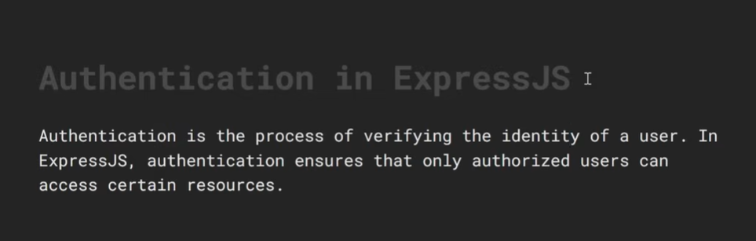
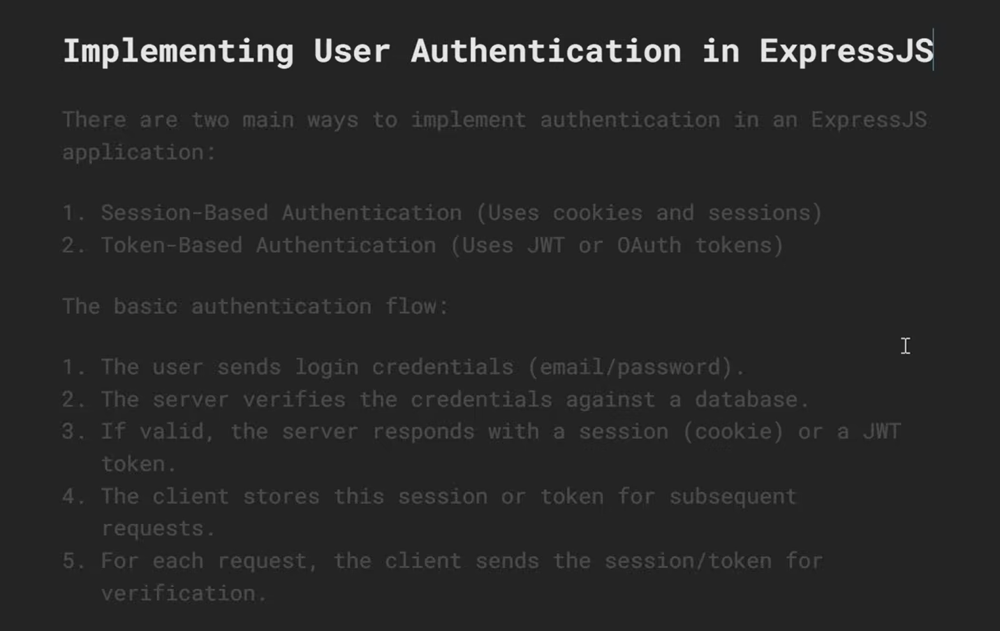

# Authentication in Express.js — A Detailed Guide

---

## Table of Contents

1. [What is Authentication?](#1-what-is-authentication)
2. [Authentication vs Authorization](#2-authentication-vs-authorization)
3. [How Authentication Works](#3-how-authentication-works)
4. [Password Hashing with bcrypt](#4-password-hashing-with-bcrypt)
5. [Session-Based Authentication](#5-session-based-authentication)
6. [JWT Authentication](#6-jwt-authentication)
7. [Session vs JWT — Which to Use](#7-session-vs-jwt--which-to-use)
8. [Role-Based Authorization](#8-role-based-authorization)
9. [Protecting Routes — Middleware](#9-protecting-routes--middleware)
10. [Refresh Tokens](#10-refresh-tokens)
11. [Google OAuth with Passport.js](#11-google-oauth-with-passportjs)
12. [Security Best Practices](#12-security-best-practices)
13. [Full JWT Auth Example](#13-full-jwt-auth-example)
14. [Full Session Auth Example](#14-full-session-auth-example)
15. [Quick Reference Cheatsheet](#15-quick-reference-cheatsheet)

---

## 1. What is Authentication?

**Authentication** is the process of verifying **who a user is**.
It answers the question: *"Are you who you claim to be?"*

```
┌──────────────────────────────────────────────────────────────────┐
│                   AUTHENTICATION FLOW                           │
├──────────────────────────────────────────────────────────────────┤
│                                                                  │
│  User: "I am Alice, here is my password"                        │
│                      │                                          │
│                      ▼                                          │
│  Server: checks credentials against database                    │
│                      │                                          │
│          ┌───────────┴───────────┐                              │
│          │                       │                              │
│       MATCH                   NO MATCH                          │
│          │                       │                              │
│          ▼                       ▼                              │
│  Issues a token/session    Returns 401 Unauthorized             │
│  "You are authenticated"   "Wrong email or password"            │
│                                                                  │
└──────────────────────────────────────────────────────────────────┘
```

### Common authentication strategies

```
┌──────────────────────┬──────────────────────────────────────────┐
│  Strategy            │  How it works                            │
├──────────────────────┼──────────────────────────────────────────┤
│  Email + Password    │  Most common — credentials in DB         │
│  JWT Tokens          │  Stateless token in header or cookie     │
│  Session Cookies     │  Server-side session store               │
│  OAuth (Google etc.) │  "Login with Google/GitHub"              │
│  API Keys            │  Static key for machine-to-machine       │
│  Magic Links         │  Passwordless email link                 │
│  OTP / 2FA           │  Time-based one-time password            │
└──────────────────────┴──────────────────────────────────────────┘
```

---

## 2. Authentication vs Authorization

These two concepts are often confused — they are completely different:

```
┌──────────────────────────────────────────────────────────────────┐
│  AUTHENTICATION                                                  │
│  "Who are you?"                                                  │
│  Verifying identity — login with email + password                │
│  Result: "You are Alice"                                         │
├──────────────────────────────────────────────────────────────────┤
│  AUTHORIZATION                                                   │
│  "What are you allowed to do?"                                   │
│  Checking permissions after identity is confirmed                │
│  Result: "Alice can read posts but not delete users"             │
└──────────────────────────────────────────────────────────────────┘
```

### Real-world example

```
1. Alice logs in with email + password          → AUTHENTICATION
   (server confirms she is Alice)

2. Alice tries to access /admin/delete-user     → AUTHORIZATION
   (server checks if Alice has the admin role)
   → Alice is "user" not "admin" → 403 Forbidden
```

```javascript
// Authentication middleware — confirms WHO you are
function isAuthenticated(req, res, next) {
  if (!req.user) return res.status(401).json({ error: "Please log in" });
  next();
}

// Authorization middleware — confirms WHAT you can do
function isAdmin(req, res, next) {
  if (req.user.role !== "admin") {
    return res.status(403).json({ error: "Admin access required" });
  }
  next();
}

// Order: authenticate first, then authorize
app.delete("/users/:id", isAuthenticated, isAdmin, deleteUser);
```

---

## 3. How Authentication Works

### The two main approaches

```
┌───────────────────────────────────────────────────────────────────┐
│  SESSION-BASED (Stateful)                                        │
│                                                                   │
│  Client          Server              Session Store (Redis/DB)    │
│    │                │                        │                   │
│    │── POST /login ─►│                        │                   │
│    │                │── save session ────────►│                   │
│    │◄── Set-Cookie ─│  { userId: 1, role: "admin" }             │
│    │   sessionId=abc│                        │                   │
│    │                │                        │                   │
│    │── GET /profile ►│                        │                   │
│    │  Cookie: abc    │── lookup session ─────►│                   │
│    │                │◄── { userId: 1 } ───────│                   │
│    │◄── 200 OK ──────│                        │                   │
│                                                                   │
│  Server STORES session data — must look it up every request      │
└───────────────────────────────────────────────────────────────────┘

┌───────────────────────────────────────────────────────────────────┐
│  JWT-BASED (Stateless)                                           │
│                                                                   │
│  Client               Server                                     │
│    │                     │                                       │
│    │── POST /login ──────►│                                       │
│    │◄── JWT token ────────│  sign({ userId: 1, role: "admin" })  │
│    │                     │                                       │
│    │── GET /profile ─────►│                                       │
│    │  Authorization:      │  verify token signature              │
│    │  Bearer <jwt>        │  decode payload (no DB lookup)        │
│    │◄── 200 OK ───────────│                                       │
│                                                                   │
│  Server stores NOTHING — all data is in the token itself         │
└───────────────────────────────────────────────────────────────────┘
```

---

## 4. Password Hashing with bcrypt

**Never store plain-text passwords.** Always hash them before saving
to the database. bcrypt is the industry standard for password hashing.

### Why bcrypt?

```
Plain text:   "password123"          → NEVER store this ❌
MD5 hash:     "482c811da5d5b4bc..."  → Fast to crack, insecure ❌
SHA256 hash:  "ef92b779bab7..."      → Still too fast to crack ❌
bcrypt hash:  "$2b$12$KIXor..."      → Slow by design — hard to brute force ✅
```

bcrypt is deliberately **slow** — it takes ~100ms to hash a password.
This makes brute-force attacks practically infeasible.

### Installation

```bash
npm install bcrypt
```

### Hashing a password

```javascript
import bcrypt from "bcrypt";

// SALT ROUNDS — how many times bcrypt applies the hashing algorithm
// Higher = slower = more secure but more CPU intensive
// 10-12 is the recommended range for most applications
const SALT_ROUNDS = 12;

// ── When a user registers ────────────────────────────────────
async function hashPassword(plainTextPassword) {
  // bcrypt.hash() automatically generates a random salt and hashes the password
  // The salt is embedded in the resulting hash — no need to store separately
  const hashedPassword = await bcrypt.hash(plainTextPassword, SALT_ROUNDS);
  return hashedPassword;
  // Returns something like:
  // "$2b$12$KIXor1nvDt3eSqy.SjOEMeVdqFCBM9IM0EjXUMM6bHjZ.q5UjNXIm"
}

// ── When a user logs in ───────────────────────────────────────
async function verifyPassword(plainTextPassword, hashedPassword) {
  // bcrypt.compare() hashes the plain text and compares with the stored hash
  // Returns true if they match, false otherwise
  const isMatch = await bcrypt.compare(plainTextPassword, hashedPassword);
  return isMatch;
}

// ── Example usage ─────────────────────────────────────────────
const plain  = "mySecretPassword";
const hashed = await hashPassword(plain);

console.log(hashed);
// → "$2b$12$KIXor1nvDt3eSqy.SjOEMeVdqFCBM9IM0EjXUMM6..."

console.log(await verifyPassword("mySecretPassword", hashed)); // → true
console.log(await verifyPassword("wrongPassword",    hashed)); // → false

// !! The same password hashed twice gives DIFFERENT results (different random salt)
const hash1 = await bcrypt.hash("password", 12);
const hash2 = await bcrypt.hash("password", 12);
console.log(hash1 === hash2); // → false (different salts)
// bcrypt.compare() handles this correctly — always use it, never ===
```

### Registration and login with bcrypt

```javascript
import express from "express";
import bcrypt  from "bcrypt";

const app = express();
app.use(express.json());

// Simulated database (use MongoDB, PostgreSQL, etc. in production)
const users = [];

// POST /auth/register
app.post("/auth/register", async (req, res) => {
  try {
    const { name, email, password } = req.body;

    // ── Validation ────────────────────────────────────────────
    if (!name || !email || !password) {
      return res.status(400).json({ error: "All fields are required" });
    }

    if (password.length < 8) {
      return res.status(400).json({ error: "Password must be at least 8 characters" });
    }

    // ── Check for duplicate email ─────────────────────────────
    const existingUser = users.find(u => u.email === email.toLowerCase());
    if (existingUser) {
      return res.status(409).json({ error: "Email already registered" });
    }

    // ── Hash the password ──────────────────────────────────────
    const hashedPassword = await bcrypt.hash(password, 12);

    // ── Save user to database ──────────────────────────────────
    const newUser = {
      id:        users.length + 1,
      name:      name.trim(),
      email:     email.trim().toLowerCase(),
      password:  hashedPassword,  // store ONLY the hash, never the plain text
      role:      "user",
      createdAt: new Date(),
    };

    users.push(newUser);

    // ── Respond — NEVER send the password back ─────────────────
    const { password: _, ...userWithoutPassword } = newUser;
    res.status(201).json({
      message: "Account created successfully",
      user:    userWithoutPassword,
    });

  } catch (err) {
    res.status(500).json({ error: "Registration failed" });
  }
});

// POST /auth/login
app.post("/auth/login", async (req, res) => {
  try {
    const { email, password } = req.body;

    if (!email || !password) {
      return res.status(400).json({ error: "Email and password are required" });
    }

    // ── Find user by email ────────────────────────────────────
    const user = users.find(u => u.email === email.toLowerCase());

    // !! Use a vague error message — don't reveal whether the
    // email exists or not (prevents user enumeration attacks)
    if (!user) {
      return res.status(401).json({ error: "Invalid email or password" });
    }

    // ── Compare password with stored hash ─────────────────────
    const isMatch = await bcrypt.compare(password, user.password);

    if (!isMatch) {
      return res.status(401).json({ error: "Invalid email or password" });
    }

    // ── Credentials are valid — issue token or session ─────────
    // (see JWT section or Session section below for this step)
    res.json({ message: "Login successful", userId: user.id });

  } catch (err) {
    res.status(500).json({ error: "Login failed" });
  }
});
```

---

## 5. Session-Based Authentication

Sessions store user data **on the server**. The browser only holds
a session ID (in a cookie). The server looks up the session data
on every request.

### Installation

```bash
npm install express-session connect-mongo bcrypt
```

### Setup

```javascript
import express      from "express";
import session      from "express-session";
import MongoStore   from "connect-mongo"; // store sessions in MongoDB
import bcrypt       from "bcrypt";

const app = express();
app.use(express.json());
app.use(express.urlencoded({ extended: true }));

// ── Session middleware ────────────────────────────────────────
app.use(session({
  // Secret used to sign the session ID cookie
  // Must be long, random, and stored in .env
  secret: process.env.SESSION_SECRET || "super-secret-session-key-32-chars",

  // resave: false — don't save session if nothing changed
  // Prevents unnecessary writes to the session store
  resave: false,

  // saveUninitialized: false — don't create a session until data is stored
  // Required by GDPR — don't set a cookie until user does something
  saveUninitialized: false,

  // Session store — where session data lives on the server
  // Default: MemoryStore (in-memory) — NEVER use in production, leaks memory
  // Use a persistent store: MongoDB, Redis, PostgreSQL
  store: MongoStore.create({
    mongoUrl: process.env.MONGODB_URI || "mongodb://localhost:27017/myapp",
    ttl:      14 * 24 * 60 * 60,  // sessions expire after 14 days (seconds)
  }),

  // Cookie settings for the session ID cookie
  cookie: {
    httpOnly: true,                                    // JS cannot read it
    secure:   process.env.NODE_ENV === "production",   // HTTPS only in prod
    sameSite: "lax",                                   // CSRF protection
    maxAge:   14 * 24 * 60 * 60 * 1000,               // 14 days (milliseconds)
  },
}));
```

### Session auth routes

```javascript
const users = []; // replace with real database

// POST /auth/register
app.post("/auth/register", async (req, res) => {
  const { name, email, password } = req.body;

  if (!name || !email || !password) {
    return res.status(400).json({ error: "All fields required" });
  }

  if (users.find(u => u.email === email)) {
    return res.status(409).json({ error: "Email already registered" });
  }

  const hashedPassword = await bcrypt.hash(password, 12);
  const user = { id: users.length + 1, name, email, password: hashedPassword, role: "user" };
  users.push(user);

  // Automatically log in after registration
  // req.session.userId — stored on the SERVER in the session store
  req.session.userId = user.id;
  req.session.role   = user.role;

  res.status(201).json({ message: "Registered and logged in", userId: user.id });
});

// POST /auth/login
app.post("/auth/login", async (req, res) => {
  const { email, password } = req.body;

  const user = users.find(u => u.email === email);
  if (!user || !(await bcrypt.compare(password, user.password))) {
    return res.status(401).json({ error: "Invalid email or password" });
  }

  // ── Session fixation prevention ───────────────────────────
  // Regenerate the session ID after login — prevents session fixation attacks
  req.session.regenerate((err) => {
    if (err) return res.status(500).json({ error: "Login failed" });

    // Store user info in the session — saved on the SERVER
    req.session.userId = user.id;
    req.session.role   = user.role;

    res.json({ message: `Welcome back, ${user.name}!` });
  });
});

// POST /auth/logout
app.post("/auth/logout", (req, res) => {
  // Destroy the session on the server AND clear the cookie
  req.session.destroy((err) => {
    if (err) return res.status(500).json({ error: "Logout failed" });

    res.clearCookie("connect.sid"); // default session cookie name
    res.json({ message: "Logged out successfully" });
  });
});
```

### Session auth middleware

```javascript
// Middleware — check if user is logged in via session
async function isAuthenticated(req, res, next) {
  // Check if the session has a userId
  if (!req.session.userId) {
    return res.status(401).json({ error: "Please log in to continue" });
  }

  // Look up the user from the database
  const user = users.find(u => u.id === req.session.userId);
  if (!user) {
    // User deleted from DB but session still exists
    req.session.destroy(() => {});
    return res.status(401).json({ error: "User not found. Please log in again" });
  }

  // Attach user to request for downstream handlers
  const { password, ...userWithoutPassword } = user;
  req.user = userWithoutPassword;
  next();
}

// Protected routes
app.get("/profile", isAuthenticated, (req, res) => {
  res.json({ user: req.user });
});

app.get("/dashboard", isAuthenticated, (req, res) => {
  res.json({
    message: `Welcome, ${req.user.name}!`,
    session: {
      id:     req.session.id,
      userId: req.session.userId,
    },
  });
});
```

---

## 6. JWT Authentication

**JSON Web Tokens (JWT)** are self-contained tokens that carry user
data inside them. The server signs the token — anyone with the public
key can verify it without hitting the database.

### JWT structure

```
eyJhbGciOiJIUzI1NiIsInR5cCI6IkpXVCJ9    ← Header  (algorithm + type)
.eyJ1c2VySWQiOjEsInJvbGUiOiJhZG1pbiJ9  ← Payload (your data)
.SflKxwRJSMeKKF2QT4fwpMeJf36POk6yJV_qb ← Signature (tamper detection)

Decoded payload:
{
  "userId": 1,
  "name":   "Alice",
  "role":   "admin",
  "iat":    1705312345,   ← issued at (Unix timestamp)
  "exp":    1705398745    ← expires at (Unix timestamp)
}
```

### Installation

```bash
npm install jsonwebtoken bcrypt cookie-parser
```

### JWT utility functions

```javascript
import jwt from "jsonwebtoken";

const JWT_SECRET          = process.env.JWT_SECRET || "your-256-bit-secret";
const JWT_EXPIRES_IN      = "15m";   // access token — short lived
const REFRESH_EXPIRES_IN  = "7d";    // refresh token — long lived

// Generate an access token — short expiry, contains user info
function generateAccessToken(user) {
  return jwt.sign(
    {
      userId: user.id,
      name:   user.name,
      role:   user.role,
    },
    JWT_SECRET,
    { expiresIn: JWT_EXPIRES_IN }
  );
}

// Generate a refresh token — long expiry, minimal payload
function generateRefreshToken(userId) {
  return jwt.sign(
    { userId },
    process.env.JWT_REFRESH_SECRET || "refresh-secret",
    { expiresIn: REFRESH_EXPIRES_IN }
  );
}

// Verify and decode a token
function verifyToken(token, secret = JWT_SECRET) {
  try {
    return jwt.verify(token, secret);
    // Returns decoded payload: { userId, name, role, iat, exp }
  } catch (err) {
    // jwt.JsonWebTokenError   → invalid signature or malformed
    // jwt.TokenExpiredError   → token has expired
    // jwt.NotBeforeError      → token used before nbf claim
    return null;
  }
}
```

### JWT auth routes

```javascript
import express      from "express";
import bcrypt       from "bcrypt";
import jwt          from "jsonwebtoken";
import cookieParser from "cookie-parser";

const app = express();
app.use(express.json());
app.use(cookieParser());

const users = [];        // replace with real DB
const refreshTokens = new Set(); // store refresh tokens (use Redis in production)

const JWT_SECRET         = process.env.JWT_SECRET         || "access-secret";
const JWT_REFRESH_SECRET = process.env.JWT_REFRESH_SECRET || "refresh-secret";

// POST /auth/register
app.post("/auth/register", async (req, res) => {
  const { name, email, password } = req.body;

  if (!name || !email || !password) {
    return res.status(400).json({ error: "All fields required" });
  }

  if (users.find(u => u.email === email)) {
    return res.status(409).json({ error: "Email already registered" });
  }

  const hashedPassword = await bcrypt.hash(password, 12);
  const user = {
    id:       users.length + 1,
    name,
    email:    email.toLowerCase(),
    password: hashedPassword,
    role:     "user",
  };
  users.push(user);

  const { password: _, ...userWithoutPassword } = user;
  res.status(201).json({
    message: "Account created",
    user:    userWithoutPassword,
  });
});

// POST /auth/login
app.post("/auth/login", async (req, res) => {
  const { email, password } = req.body;

  const user = users.find(u => u.email === email?.toLowerCase());
  if (!user || !(await bcrypt.compare(password, user.password))) {
    return res.status(401).json({ error: "Invalid email or password" });
  }

  // Generate tokens
  const accessToken  = jwt.sign(
    { userId: user.id, name: user.name, role: user.role },
    JWT_SECRET,
    { expiresIn: "15m" }
  );

  const refreshToken = jwt.sign(
    { userId: user.id },
    JWT_REFRESH_SECRET,
    { expiresIn: "7d" }
  );

  // Store refresh token (use Redis or DB in production)
  refreshTokens.add(refreshToken);

  // Send access token in response body (for API clients)
  // Send refresh token in HttpOnly cookie (cannot be stolen by XSS)
  res.cookie("refreshToken", refreshToken, {
    httpOnly: true,
    secure:   process.env.NODE_ENV === "production",
    sameSite: "lax",
    maxAge:   7 * 24 * 60 * 60 * 1000,  // 7 days
  });

  res.json({
    message:     "Login successful",
    accessToken,              // client stores in memory (NOT localStorage)
    expiresIn:   15 * 60,     // seconds
  });
});

// POST /auth/logout
app.post("/auth/logout", (req, res) => {
  const refreshToken = req.cookies.refreshToken;

  // Invalidate the refresh token on the server
  refreshTokens.delete(refreshToken);

  // Clear the refresh token cookie
  res.clearCookie("refreshToken");

  res.json({ message: "Logged out successfully" });
});
```

### JWT auth middleware

```javascript
// Middleware — verify the JWT from the Authorization header
function verifyJWT(req, res, next) {
  // Standard format: "Authorization: Bearer <token>"
  const authHeader = req.headers["authorization"];

  if (!authHeader) {
    return res.status(401).json({ error: "No authorization header" });
  }

  if (!authHeader.startsWith("Bearer ")) {
    return res.status(401).json({ error: "Invalid authorization format. Use: Bearer <token>" });
  }

  const token = authHeader.split(" ")[1]; // extract the token part

  try {
    // jwt.verify throws if token is invalid or expired
    const decoded = jwt.verify(token, JWT_SECRET);

    // Attach decoded payload to req for downstream handlers
    // decoded = { userId: 1, name: "Alice", role: "admin", iat: ..., exp: ... }
    req.user = decoded;
    next();

  } catch (err) {
    if (err.name === "TokenExpiredError") {
      return res.status(401).json({ error: "Token expired. Please refresh." });
    }
    return res.status(401).json({ error: "Invalid token" });
  }
}

// Alternative — JWT from HttpOnly cookie (for browser clients)
function verifyJWTFromCookie(req, res, next) {
  const token = req.cookies.accessToken;

  if (!token) {
    return res.status(401).json({ error: "Not authenticated" });
  }

  try {
    req.user = jwt.verify(token, JWT_SECRET);
    next();
  } catch (err) {
    res.clearCookie("accessToken");
    return res.status(401).json({ error: "Invalid or expired token" });
  }
}

// Protected routes
app.get("/api/profile", verifyJWT, (req, res) => {
  // req.user is the decoded JWT payload
  res.json({
    userId: req.user.userId,
    name:   req.user.name,
    role:   req.user.role,
  });
});

app.get("/api/dashboard", verifyJWT, (req, res) => {
  res.json({ message: `Welcome, ${req.user.name}!` });
});
```

---

## 7. Session vs JWT — Which to Use

```
┌──────────────────────────┬───────────────────────────────────────┐
│                          │  SESSION                              │
├──────────────────────────┼───────────────────────────────────────┤
│ State storage            │  Server (DB, Redis)                   │
│ What browser holds       │  Session ID only (in cookie)          │
│ Revocation               │  ✅ Instant — delete from store       │
│ Server load              │  DB lookup on every request           │
│ Scalability              │  Needs shared store for multi-server  │
│ Best for                 │  Traditional web apps with SSR        │
│ Security                 │  ✅ Data never leaves server          │
└──────────────────────────┴───────────────────────────────────────┘

┌──────────────────────────┬───────────────────────────────────────┐
│                          │  JWT                                  │
├──────────────────────────┼───────────────────────────────────────┤
│ State storage            │  Client (token itself)                │
│ What browser holds       │  Full signed token                    │
│ Revocation               │  ❌ Hard — must use blocklist         │
│ Server load              │  No DB lookup (verify signature only) │
│ Scalability              │  ✅ Stateless — works across servers  │
│ Best for                 │  APIs, SPAs, mobile apps              │
│ Security                 │  ⚠️ Payload visible (not encrypted)   │
└──────────────────────────┴───────────────────────────────────────┘
```

### Decision guide

```
Building a traditional web app (EJS, Pug) with SSR?  → Sessions
Building a REST API consumed by React/Vue/mobile?     → JWT
Need instant logout/revocation (banking, medical)?    → Sessions
Multiple servers / microservices?                     → JWT
Simple app with a single server?                      → Either
```

---

## 8. Role-Based Authorization

After authentication, restrict what each role can do:

```javascript
// User roles in the system
const ROLES = {
  USER:      "user",
  EDITOR:    "editor",
  MODERATOR: "moderator",
  ADMIN:     "admin",
};

// ── Role middleware factory ────────────────────────────────────
// Returns a middleware that only allows specified roles
function requireRole(...allowedRoles) {
  return (req, res, next) => {
    // Must be called AFTER isAuthenticated (req.user must exist)
    if (!req.user) {
      return res.status(401).json({ error: "Authentication required" });
    }

    if (!allowedRoles.includes(req.user.role)) {
      return res.status(403).json({
        error:    "Insufficient permissions",
        required: allowedRoles,
        yourRole: req.user.role,
      });
    }

    next();
  };
}

// ── Route protection examples ─────────────────────────────────

// Public — no authentication needed
app.get("/posts", getPosts);

// Any logged-in user
app.get("/profile", isAuthenticated, getProfile);

// Only editors and admins can create posts
app.post("/posts", isAuthenticated, requireRole("editor", "admin"), createPost);

// Only moderators and admins can delete posts
app.delete("/posts/:id", isAuthenticated, requireRole("moderator", "admin"), deletePost);

// Only admins can access the admin panel
app.get("/admin",         isAuthenticated, requireRole("admin"), getAdminDashboard);
app.delete("/users/:id",  isAuthenticated, requireRole("admin"), deleteUser);
app.patch("/users/:id/role", isAuthenticated, requireRole("admin"), updateUserRole);
```

### Resource ownership check

```javascript
// Users should only be able to edit their OWN posts
// (unless they are an admin)
async function canEditPost(req, res, next) {
  const post = await Post.findById(req.params.id);

  if (!post) {
    return res.status(404).json({ error: "Post not found" });
  }

  // Admins can edit anyone's post
  // Users can only edit their own
  if (req.user.role !== "admin" && post.authorId !== req.user.userId) {
    return res.status(403).json({
      error: "You can only edit your own posts"
    });
  }

  req.post = post; // attach post for the handler to use
  next();
}

app.put("/posts/:id", isAuthenticated, canEditPost, updatePost);
```

---

## 9. Protecting Routes — Middleware

### Protecting all routes on a router

```javascript
import { Router } from "express";

// ── Admin router — all routes require admin role ──────────────
const adminRouter = Router();

adminRouter.use(isAuthenticated);       // step 1: must be logged in
adminRouter.use(requireRole("admin"));  // step 2: must be admin

// All routes below are protected by both middleware above
adminRouter.get("/dashboard",      getAdminDashboard);
adminRouter.get("/users",          getAllUsers);
adminRouter.patch("/users/:id",    updateUser);
adminRouter.delete("/users/:id",   deleteUser);
adminRouter.get("/analytics",      getAnalytics);

app.use("/admin", adminRouter);

// Resulting protected routes:
// GET    /admin/dashboard
// GET    /admin/users
// PATCH  /admin/users/:id
// DELETE /admin/users/:id
// GET    /admin/analytics
```

### Global authentication with exceptions

```javascript
// Apply authentication to ALL routes by default
app.use(isAuthenticated);

// But allow certain public routes BEFORE the global middleware
// Order matters — public routes must come first

// Option A — define public routes before app.use(isAuthenticated)
app.post("/auth/login",    loginHandler);    // public
app.post("/auth/register", registerHandler); // public
app.get("/",               homeHandler);     // public

app.use(isAuthenticated);  // everything after this requires auth

app.get("/dashboard", dashboardHandler);    // protected
app.get("/profile",   profileHandler);      // protected
```

### Route whitelist pattern

```javascript
// List of routes that don't require authentication
const PUBLIC_ROUTES = [
  { path: "/",                method: "GET"  },
  { path: "/auth/login",      method: "POST" },
  { path: "/auth/register",   method: "POST" },
  { path: "/posts",           method: "GET"  },
];

function globalAuth(req, res, next) {
  // Check if this request matches any public route
  const isPublic = PUBLIC_ROUTES.some(
    route => route.path === req.path && route.method === req.method
  );

  if (isPublic) return next(); // skip auth for public routes

  // All other routes require authentication
  isAuthenticated(req, res, next);
}

app.use(globalAuth);
```

---

## 10. Refresh Tokens

Access tokens should be **short-lived** (15 minutes). When they expire,
the client uses a **refresh token** to get a new access token without
re-entering credentials.

```
Access Token:  short-lived (15m) — used for every API request
Refresh Token: long-lived (7d)   — used only to get new access tokens
```

```javascript
// POST /auth/refresh — get a new access token using the refresh token
app.post("/auth/refresh", (req, res) => {
  // Refresh token is stored in an HttpOnly cookie
  const refreshToken = req.cookies.refreshToken;

  if (!refreshToken) {
    return res.status(401).json({ error: "No refresh token" });
  }

  // Check if the refresh token is in our store (not revoked)
  if (!refreshTokens.has(refreshToken)) {
    return res.status(403).json({ error: "Refresh token has been revoked" });
  }

  try {
    // Verify the refresh token
    const decoded = jwt.verify(refreshToken, JWT_REFRESH_SECRET);

    // Look up the user (to get latest role/status)
    const user = users.find(u => u.id === decoded.userId);
    if (!user) {
      return res.status(403).json({ error: "User not found" });
    }

    // Issue a NEW access token
    const newAccessToken = jwt.sign(
      { userId: user.id, name: user.name, role: user.role },
      JWT_SECRET,
      { expiresIn: "15m" }
    );

    res.json({
      accessToken: newAccessToken,
      expiresIn:   15 * 60,
    });

  } catch (err) {
    // Refresh token expired or invalid
    refreshTokens.delete(refreshToken);
    res.clearCookie("refreshToken");
    return res.status(403).json({ error: "Invalid or expired refresh token. Please log in again." });
  }
});
```

### Token refresh flow on the client

```javascript
// Client-side token management (pseudo-code)
let accessToken = null;

async function apiRequest(url, options = {}) {
  // Attach the access token to every request
  const response = await fetch(url, {
    ...options,
    headers: {
      ...options.headers,
      "Authorization": `Bearer ${accessToken}`,
    },
    credentials: "include", // send cookies (for refresh token)
  });

  // If access token expired, refresh and retry
  if (response.status === 401) {
    const refreshed = await fetch("/auth/refresh", {
      method:      "POST",
      credentials: "include",  // sends the refresh token cookie
    });

    if (refreshed.ok) {
      const data  = await refreshed.json();
      accessToken = data.accessToken;  // store new access token in memory

      // Retry the original request with the new token
      return fetch(url, {
        ...options,
        headers: {
          ...options.headers,
          "Authorization": `Bearer ${accessToken}`,
        },
        credentials: "include",
      });
    } else {
      // Refresh failed — redirect to login
      window.location.href = "/login";
    }
  }

  return response;
}
```

---

## 11. Google OAuth with Passport.js

**OAuth** lets users log in with an existing account (Google, GitHub, etc.)
without creating a new password.

### Installation

```bash
npm install passport passport-google-oauth20 express-session
```

### Setup

```javascript
import express         from "express";
import session         from "express-session";
import passport        from "passport";
import { Strategy as GoogleStrategy } from "passport-google-oauth20";

const app = express();

app.use(session({
  secret:            process.env.SESSION_SECRET,
  resave:            false,
  saveUninitialized: false,
  cookie:            { maxAge: 24 * 60 * 60 * 1000 },
}));

// Initialize Passport
app.use(passport.initialize());
app.use(passport.session()); // restore auth state from session

// ── Passport Google Strategy ──────────────────────────────────
passport.use(new GoogleStrategy(
  {
    clientID:     process.env.GOOGLE_CLIENT_ID,
    clientSecret: process.env.GOOGLE_CLIENT_SECRET,
    callbackURL:  "/auth/google/callback",
    scope:        ["profile", "email"],
  },

  // Verify callback — called when Google returns user data
  async (accessToken, refreshToken, profile, done) => {
    try {
      // profile.id       → Google user ID
      // profile.displayName → "Alice Smith"
      // profile.emails[0].value → "alice@gmail.com"
      // profile.photos[0].value → profile picture URL

      // Find or create user in your database
      let user = users.find(u => u.googleId === profile.id);

      if (!user) {
        // First login — create a new user
        user = {
          id:          users.length + 1,
          googleId:    profile.id,
          name:        profile.displayName,
          email:       profile.emails[0].value,
          avatar:      profile.photos[0].value,
          role:        "user",
        };
        users.push(user);
      }

      // done(error, user) — pass user to serializeUser
      return done(null, user);

    } catch (err) {
      return done(err, null);
    }
  }
));

// ── Serialize / Deserialize ───────────────────────────────────
// serializeUser — what to store in the session (just the ID)
passport.serializeUser((user, done) => {
  done(null, user.id);
});

// deserializeUser — called on every request to get the full user from the ID
passport.deserializeUser((id, done) => {
  const user = users.find(u => u.id === id);
  done(null, user || false);
});

// ── OAuth Routes ──────────────────────────────────────────────

// Step 1 — Redirect user to Google's login page
app.get("/auth/google",
  passport.authenticate("google", { scope: ["profile", "email"] })
);

// Step 2 — Google redirects back to this URL with a code
app.get("/auth/google/callback",
  passport.authenticate("google", {
    failureRedirect: "/login?error=google-failed",
  }),
  (req, res) => {
    // Authentication successful — req.user is set
    res.redirect("/dashboard");
  }
);

// Logout
app.post("/auth/logout", (req, res) => {
  req.logout(() => {
    req.session.destroy();
    res.redirect("/");
  });
});

// Protected route — passport populates req.user via deserializeUser
app.get("/dashboard",
  (req, res, next) => {
    if (!req.isAuthenticated()) return res.redirect("/login");
    next();
  },
  (req, res) => {
    res.json({ user: req.user });
  }
);
```

---

## 12. Security Best Practices

### Rate limit login attempts

```javascript
import rateLimit from "express-rate-limit"; // npm install express-rate-limit

// Prevent brute-force attacks on the login route
const loginLimiter = rateLimit({
  windowMs: 15 * 60 * 1000,  // 15 minute window
  max:      10,                // max 10 login attempts per IP per window
  message:  { error: "Too many login attempts. Please try again in 15 minutes." },
  standardHeaders: true,
  legacyHeaders:   false,
});

app.post("/auth/login", loginLimiter, loginHandler);
```

### Secure password reset flow

```javascript
import crypto from "crypto";

const resetTokens = new Map(); // { token → { userId, expiresAt } }

// POST /auth/forgot-password
app.post("/auth/forgot-password", async (req, res) => {
  const { email } = req.body;
  const user = users.find(u => u.email === email);

  // Always respond with the same message — don't reveal if email exists
  const genericResponse = { message: "If that email exists, a reset link has been sent." };

  if (!user) return res.json(genericResponse);

  // Generate a secure random token
  const token     = crypto.randomBytes(32).toString("hex");
  const expiresAt = Date.now() + 60 * 60 * 1000; // 1 hour

  // Store hashed token (never store raw token)
  const hashedToken = crypto.createHash("sha256").update(token).digest("hex");
  resetTokens.set(hashedToken, { userId: user.id, expiresAt });

  // Send email with reset link (use nodemailer in production)
  const resetUrl = `http://localhost:3000/auth/reset-password?token=${token}`;
  console.log(`Reset URL (send via email): ${resetUrl}`);

  res.json(genericResponse);
});

// POST /auth/reset-password
app.post("/auth/reset-password", async (req, res) => {
  const { token, newPassword } = req.body;

  if (!token || !newPassword) {
    return res.status(400).json({ error: "Token and new password are required" });
  }

  // Hash the token and look it up
  const hashedToken = crypto.createHash("sha256").update(token).digest("hex");
  const resetData   = resetTokens.get(hashedToken);

  if (!resetData || Date.now() > resetData.expiresAt) {
    return res.status(400).json({ error: "Invalid or expired reset token" });
  }

  // Hash the new password and update
  const user = users.find(u => u.id === resetData.userId);
  if (!user) return res.status(404).json({ error: "User not found" });

  user.password = await bcrypt.hash(newPassword, 12);

  // Invalidate the token after use
  resetTokens.delete(hashedToken);

  res.json({ message: "Password updated successfully. Please log in." });
});
```

### Security checklist

```
✅ Hash passwords with bcrypt (salt rounds 10-12)
✅ Use httpOnly cookies for tokens
✅ Use HTTPS (secure: true on cookies) in production
✅ Set sameSite: "lax" or "strict" on cookies
✅ Rate-limit login and register endpoints
✅ Vague login error messages (don't reveal if email exists)
✅ Regenerate session ID after login (session fixation prevention)
✅ Short-lived access tokens (15 minutes) with refresh tokens
✅ Never store JWTs in localStorage (use memory or httpOnly cookie)
✅ Never log passwords, tokens, or sensitive data
✅ Validate and sanitize ALL user input
✅ Use CSRF protection for session-based apps
✅ Store refresh tokens in HttpOnly cookies
✅ Invalidate all tokens/sessions on password change
```

---

## 13. Full JWT Auth Example

```javascript
// server.js — Complete JWT authentication system
import express      from "express";
import bcrypt       from "bcrypt";
import jwt          from "jsonwebtoken";
import cookieParser from "cookie-parser";
import rateLimit    from "express-rate-limit";
import "dotenv/config";

const app = express();
app.use(express.json());
app.use(cookieParser());

const PORT               = process.env.PORT               || 3000;
const JWT_SECRET         = process.env.JWT_SECRET         || "access-secret-key";
const JWT_REFRESH_SECRET = process.env.JWT_REFRESH_SECRET || "refresh-secret-key";

// In-memory stores (replace with MongoDB/Redis in production)
const users         = [];
const refreshTokens = new Set();

// Rate limiter for auth routes
const authLimiter = rateLimit({
  windowMs: 15 * 60 * 1000,
  max:      20,
  message:  { error: "Too many requests. Try again later." },
});

// ── Middleware ────────────────────────────────────────────────
function verifyJWT(req, res, next) {
  const authHeader = req.headers["authorization"];
  if (!authHeader?.startsWith("Bearer ")) {
    return res.status(401).json({ error: "Authorization header required" });
  }

  const token = authHeader.split(" ")[1];
  try {
    req.user = jwt.verify(token, JWT_SECRET);
    next();
  } catch (err) {
    const message = err.name === "TokenExpiredError"
      ? "Token expired"
      : "Invalid token";
    res.status(401).json({ error: message });
  }
}

function requireRole(...roles) {
  return (req, res, next) => {
    if (!roles.includes(req.user?.role)) {
      return res.status(403).json({ error: "Insufficient permissions" });
    }
    next();
  };
}

// ── Routes ────────────────────────────────────────────────────

// POST /auth/register
app.post("/auth/register", authLimiter, async (req, res) => {
  try {
    const { name, email, password } = req.body;
    if (!name || !email || !password) {
      return res.status(400).json({ error: "All fields required" });
    }
    if (password.length < 8) {
      return res.status(400).json({ error: "Password must be at least 8 characters" });
    }
    if (users.find(u => u.email === email.toLowerCase())) {
      return res.status(409).json({ error: "Email already registered" });
    }

    const hashedPassword = await bcrypt.hash(password, 12);
    const user = {
      id: users.length + 1,
      name: name.trim(),
      email: email.toLowerCase().trim(),
      password: hashedPassword,
      role: "user",
    };
    users.push(user);

    const { password: _, ...safe } = user;
    res.status(201).json({ message: "Account created", user: safe });

  } catch (err) {
    res.status(500).json({ error: "Registration failed" });
  }
});

// POST /auth/login
app.post("/auth/login", authLimiter, async (req, res) => {
  try {
    const { email, password } = req.body;
    const user = users.find(u => u.email === email?.toLowerCase());

    if (!user || !(await bcrypt.compare(password, user.password))) {
      return res.status(401).json({ error: "Invalid email or password" });
    }

    const accessToken = jwt.sign(
      { userId: user.id, name: user.name, role: user.role },
      JWT_SECRET,
      { expiresIn: "15m" }
    );

    const refreshToken = jwt.sign(
      { userId: user.id },
      JWT_REFRESH_SECRET,
      { expiresIn: "7d" }
    );

    refreshTokens.add(refreshToken);

    res.cookie("refreshToken", refreshToken, {
      httpOnly: true,
      secure:   process.env.NODE_ENV === "production",
      sameSite: "lax",
      maxAge:   7 * 24 * 60 * 60 * 1000,
    });

    res.json({ accessToken, expiresIn: 900 });

  } catch (err) {
    res.status(500).json({ error: "Login failed" });
  }
});

// POST /auth/refresh
app.post("/auth/refresh", (req, res) => {
  const refreshToken = req.cookies.refreshToken;
  if (!refreshToken || !refreshTokens.has(refreshToken)) {
    return res.status(403).json({ error: "Invalid refresh token" });
  }

  try {
    const decoded    = jwt.verify(refreshToken, JWT_REFRESH_SECRET);
    const user       = users.find(u => u.id === decoded.userId);
    if (!user) return res.status(403).json({ error: "User not found" });

    const accessToken = jwt.sign(
      { userId: user.id, name: user.name, role: user.role },
      JWT_SECRET,
      { expiresIn: "15m" }
    );

    res.json({ accessToken, expiresIn: 900 });

  } catch {
    refreshTokens.delete(refreshToken);
    res.clearCookie("refreshToken");
    res.status(403).json({ error: "Refresh token expired. Please log in again." });
  }
});

// POST /auth/logout
app.post("/auth/logout", (req, res) => {
  refreshTokens.delete(req.cookies.refreshToken);
  res.clearCookie("refreshToken");
  res.json({ message: "Logged out" });
});

// GET /api/me — protected
app.get("/api/me", verifyJWT, (req, res) => {
  const user = users.find(u => u.id === req.user.userId);
  if (!user) return res.status(404).json({ error: "User not found" });
  const { password: _, ...safe } = user;
  res.json({ user: safe });
});

// GET /api/admin — admin only
app.get("/api/admin", verifyJWT, requireRole("admin"), (req, res) => {
  res.json({ message: "Admin area", users: users.map(({ password: _, ...u }) => u) });
});

app.listen(PORT, () => console.log(`JWT auth server at http://localhost:${PORT}`));
```

---

## 14. Full Session Auth Example

```javascript
// server.js — Complete session authentication system
import express    from "express";
import session    from "express-session";
import bcrypt     from "bcrypt";
import rateLimit  from "express-rate-limit";
import "dotenv/config";

const app = express();
app.use(express.json());
app.use(express.urlencoded({ extended: true }));
app.set("view engine", "ejs");

app.use(session({
  secret:            process.env.SESSION_SECRET || "session-secret-key",
  resave:            false,
  saveUninitialized: false,
  cookie: {
    httpOnly: true,
    secure:   process.env.NODE_ENV === "production",
    sameSite: "lax",
    maxAge:   24 * 60 * 60 * 1000, // 1 day
  },
}));

const users     = [];
const authLimit = rateLimit({ windowMs: 15 * 60 * 1000, max: 20 });

// ── Middleware ────────────────────────────────────────────────
async function isAuthenticated(req, res, next) {
  if (!req.session.userId) {
    return res.status(401).json({ error: "Please log in" });
  }
  const user = users.find(u => u.id === req.session.userId);
  if (!user) {
    req.session.destroy(() => {});
    return res.status(401).json({ error: "Session expired. Please log in." });
  }
  const { password: _, ...safe } = user;
  req.user = safe;
  next();
}

function requireRole(...roles) {
  return (req, res, next) => {
    if (!req.user || !roles.includes(req.user.role)) {
      return res.status(403).json({ error: "Insufficient permissions" });
    }
    next();
  };
}

// ── Routes ────────────────────────────────────────────────────

app.post("/auth/register", authLimit, async (req, res) => {
  const { name, email, password } = req.body;
  if (!name || !email || !password) {
    return res.status(400).json({ error: "All fields required" });
  }
  if (users.find(u => u.email === email)) {
    return res.status(409).json({ error: "Email already registered" });
  }

  const user = {
    id: users.length + 1,
    name, email: email.toLowerCase(),
    password: await bcrypt.hash(password, 12),
    role: "user",
  };
  users.push(user);

  req.session.userId = user.id;
  req.session.role   = user.role;

  const { password: _, ...safe } = user;
  res.status(201).json({ message: "Registered", user: safe });
});

app.post("/auth/login", authLimit, async (req, res) => {
  const { email, password } = req.body;
  const user = users.find(u => u.email === email?.toLowerCase());

  if (!user || !(await bcrypt.compare(password, user.password))) {
    return res.status(401).json({ error: "Invalid email or password" });
  }

  req.session.regenerate((err) => {
    if (err) return res.status(500).json({ error: "Login failed" });
    req.session.userId = user.id;
    req.session.role   = user.role;
    res.json({ message: `Welcome, ${user.name}!` });
  });
});

app.post("/auth/logout", (req, res) => {
  req.session.destroy((err) => {
    if (err) return res.status(500).json({ error: "Logout failed" });
    res.clearCookie("connect.sid");
    res.json({ message: "Logged out" });
  });
});

app.get("/api/me",    isAuthenticated, (req, res) => res.json({ user: req.user }));
app.get("/api/admin", isAuthenticated, requireRole("admin"), (req, res) => {
  res.json({ users: users.map(({ password: _, ...u }) => u) });
});

app.listen(3000, () => console.log("Session auth server at http://localhost:3000"));
```

---

## 15. Quick Reference Cheatsheet

```
┌──────────────────────────────────────────────────────────────────┐
│                   PACKAGES                                      │
├──────────────────────────────────────────────────────────────────┤
│  bcrypt            → password hashing                           │
│  jsonwebtoken      → JWT sign/verify                            │
│  express-session   → server-side sessions                       │
│  cookie-parser     → read cookies in Express                    │
│  connect-mongo     → store sessions in MongoDB                  │
│  passport          → OAuth strategies (Google, GitHub, etc.)    │
│  express-validator → input validation                           │
│  express-rate-limit→ brute-force protection                     │
└──────────────────────────────────────────────────────────────────┘

┌──────────────────────────────────────────────────────────────────┐
│                 BCRYPT CHEATSHEET                               │
├──────────────────────────────────────────────────────────────────┤
│  await bcrypt.hash(password, 12)              // hash           │
│  await bcrypt.compare(plain, hash)            // verify         │
│  NEVER store plain text passwords             //                │
│  NEVER compare hashes with ===                //                │
└──────────────────────────────────────────────────────────────────┘

┌──────────────────────────────────────────────────────────────────┐
│                  JWT CHEATSHEET                                 │
├──────────────────────────────────────────────────────────────────┤
│  jwt.sign(payload, secret, { expiresIn })     // create token   │
│  jwt.verify(token, secret)                    // verify + decode│
│  Access token:  15m in Authorization header                     │
│  Refresh token: 7d  in HttpOnly cookie                          │
│  NEVER store JWT in localStorage              //                │
└──────────────────────────────────────────────────────────────────┘

┌──────────────────────────────────────────────────────────────────┐
│               SESSION vs JWT                                    │
├──────────────────────────────┬───────────────────────────────────┤
│  SESSION                     │  JWT                             │
├──────────────────────────────┼───────────────────────────────────┤
│  State on server             │  State in token (client)         │
│  Instant revocation ✅        │  Hard to revoke ❌               │
│  DB lookup each request      │  No DB lookup (verify only)      │
│  Good for SSR web apps       │  Good for APIs + SPAs            │
└──────────────────────────────┴───────────────────────────────────┘

┌──────────────────────────────────────────────────────────────────┐
│               AUTH COOKIE SETTINGS                              │
├──────────────────────────────────────────────────────────────────┤
│  httpOnly: true              → blocks XSS theft                 │
│  secure: true                → HTTPS only (production)          │
│  sameSite: "lax"             → CSRF protection                  │
│  maxAge: 7 * 24 * 60 * 60000 → 7 days                          │
└──────────────────────────────────────────────────────────────────┘
```

---

> **Summary:** Authentication in Express has two main approaches —
> **sessions** (stateful, great for SSR apps, instant revocation)
> and **JWT** (stateless, great for APIs and SPAs, scales easily).
> Always hash passwords with bcrypt, store tokens in HttpOnly cookies,
> rate-limit auth endpoints, keep error messages vague, and regenerate
> session IDs after login. Security is not optional — bake it in from
> the start.



